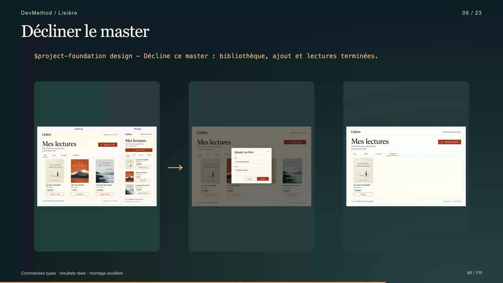
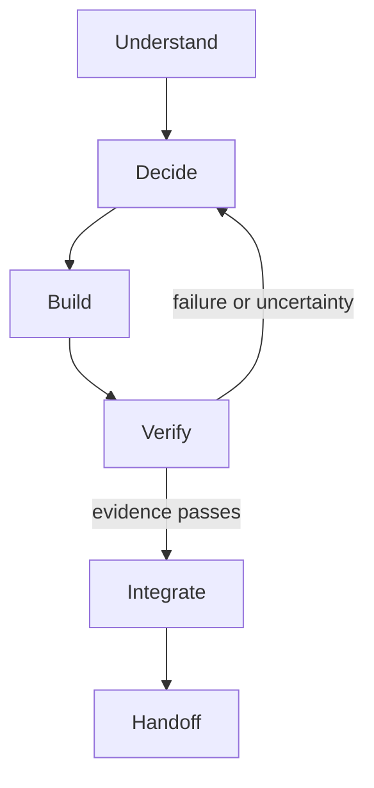

# DevMethod

From idea to delivery with your AI coding agents.

[](https://www.npmjs.com/package/devmethod-ai) [](LICENSE) [](https://github.com/montassarkhalloufi/DevMethod/actions/workflows/platform-tests.yml)

## Watch DevMethod build Lisière — 2 min 58 s

[](https://github.com/montassarkhalloufi/DevMethod/raw/refs/heads/main/docs/media/visual-chain/devmethod-du-besoin-au-produit-4k.fr.mp4)

**[▶ Watch the video — 4K, French narration](https://github.com/montassarkhalloufi/DevMethod/raw/refs/heads/main/docs/media/visual-chain/devmethod-du-besoin-au-produit-4k.fr.mp4)** · [Subtitles and execution evidence](docs/media/visual-chain/README.md) · [Download the working prototype](https://github.com/montassarkhalloufi/DevMethod/raw/refs/heads/main/docs/media/visual-chain/lisiere-visual-source.zip)

**Concrete example: Lisière, a personal reading library.** Start with an idea, compare three visual directions, approve a master screen, derive the other screen images, choose a suitable architecture, then build and verify the application.

| Step shown | Concrete result |
| --- | --- |
| Explore and frame | Add books, filter readings and track three statuses |
| Design | Three alternatives → selected editorial master → add-book and completed-reading images |
| Architecture | HTML/CSS/JavaScript, testable book rules and browser-local storage |
| Plan, ready and implement | Working form, filters, status changes and saved books |
| Review and verify | Corrected alert/focus behavior, 6 tests and real Chrome desktop/mobile journeys |
| Integrate and handoff | Local prototype, references, evidence and resumption context |

The video uses illustrative Codex commands with real generated images and recorded application interactions. DevMethod guides the coding agent; image generation requires an available host tool. The visual workflow is in the current GitHub source and is not included in npm 0.1.0. [Follow the visual workflow](docs/VISUAL-WORKFLOW.md).


DevMethod is the public name of the kit. Its entry-point skill remains `project-foundation`, preserving existing invocations and the six-module structure.

A reusable workflow for taking a software project from exploration to delivery: decisions, UX, architecture, tickets, development, tests, review and handoff. Six focused skills support fourteen workflow stages, each ending with evidence, limitations and one suggested next command.

**Published on npm: 0.1.0 (`latest`).** The release includes mission/context inspection, Git-aware evidence resumption, explicit update conflicts, manual task planning and optional stack profiles. See the [release record](docs/RELEASE-0.1.0.md) for publication status and verification.

For developers and small teams using coding agents in new or existing repositories. Requires Node.js 22+ and npm; Git is required for context provenance. Application examples have separate framework/database prerequisites. DevMethod records scope, decisions and verification; it does not certify agent output, infer all dependencies, deploy applications or run an autonomous backlog. Installation and deterministic fixture results are separate from native host validation. See [compatibility](COMPATIBILITY.md).

Start with [missions and the tested source quick start](docs/MISSIONS.md), the [tested from-zero Pocket Tasks project](examples/pocket-tasks/README.md), then the [complete Next.js/NestJS example](examples/fullstack/README.md). Advanced references: [context and sizing](docs/MISSIONS.md), [safe updates](docs/UPDATES.md), [resumption](docs/RESUMPTION.md), [optional stack profiles](docs/STACK-PROFILES.md), [bounded manual planning](docs/ORCHESTRATION.md), [troubleshooting](docs/TROUBLESHOOTING.md), and [release status and evidence](docs/RELEASE-0.1.0.md).

## Install in a project

Requires Node.js 22+ and npm. Install into a fresh staging directory first:

```bash
npx --yes devmethod-ai@0.1.0 init --tool codex --dest ../foundation-staging
```

Choose `codex`, `claude` or `cursor`. If you omit `--tool`, an interactive terminal asks. For example:

```bash
npx --yes devmethod-ai@0.1.0 init --tool claude --dest ../foundation-staging --dry-run
```

Remove `--dry-run` to write. Select a subset with `--modules decision-architecture,scoped-delivery`; `project-foundation` is always included. Without `--modules`, all six modules are installed. The installer refuses divergent files and duplicate skills across host directories. It never edits AGENTS.md, CLAUDE.md or your package.json. Review the staging output, then merge only what the project needs.

The installer has no runtime dependencies and makes no network requests after npm obtains the package. To pin the final version, use `npx --yes devmethod-ai@0.1.0 init ...`. To use a reviewed repository commit instead, use `npx --yes --package=github:montassarkhalloufi/DevMethod#<commit-sha> devmethod init ...`.

Complete PROJECT_PROFILE.md with your real stack, commands, scope, deployment permissions and data requirements. Merge AGENTS.foundation.md into the project's existing instructions only after review. Claude Code reads CLAUDE.md: preserve its current content and, if the project has AGENTS.md, optionally add `@AGENTS.md` to import it. Keep existing accepted architecture decisions authoritative.

The installer includes `DEVMETHOD-LICENSE` so it preserves your application's LICENSE. Retain that MIT notice with redistributed copies. Repository-level release documents and the CLI are not copied into your application.

Installation copies the reusable method and blank templates, not another project's context. Preserve filled profiles, decisions, tickets and instruction files separately. Manifest hashes describe the initial installation; local template customization is expected to change them. To install elsewhere, run the CLI again.

## Verify the source checkout

From a reviewed source checkout:

```sh
npm ci
npm test
npm run check:docs
npm pack --dry-run
node dist/cli.js init --tool codex --dest ../candidate-staging
node dist/cli.js doctor --dest ../candidate-staging --json
node dist/cli.js update-preview --dest ../candidate-staging --json
```

The package includes advanced docs and fictional examples. `init` copies only the skills and adoption templates, preserving the application. Read the package docs from its checkout or extracted tarball. The core CLI has no runtime dependencies; example applications install their own pinned dependencies separately.

## Inspect an adopted installation

From a reviewed source checkout, inspect an installed project without changing it:

```bash
node dist/cli.js doctor --dest /path/to/project --json
```

Doctor reports missing files, changes from the initial manifest and duplicate host copies. Customized profiles and skills produce warnings; they are preserved. It does not execute an agent or certify application quality. See [diagnostic codes and exit statuses](docs/DOCTOR.md).

## Choose the amount of process

The stages below are available entry points, not fourteen mandatory conversations.

| Path | Typical work | Expected process |
|---|---|---|
| Quick | Clear bug fix inside existing contracts | Inline readiness, implementation, focused verification and review |
| Standard | Feature spanning components or sessions | Ready slice, relevant contracts, checks and resumable evidence |
| Major | New product decisions or consequential architecture changes | Resolve decisions, split into slices, verify integration |

Risk and repository policy override apparent size. Reuse accepted UI, architecture and project context; only fill actual gaps. See [work sizing](.agents/skills/project-foundation/references/work-sizing.md) and [starter exercises](examples/README.md).

## Run the workflow

In Codex: `$project-foundation status`.

In Claude Code or Cursor: `/project-foundation status`.

Replace `status` with an action below. These are prompts to the skill, not shell commands or standalone `/verify` commands. They do not create a background autonomous loop.

| Action | Result |
|---|---|
| `explore` | Problem, users, alternatives and constraints |
| `frame` | Product scope, exclusions and success measures |
| `design` | Visual directions, selected mockups and UX criteria; image tooling depends on the host |
| `architecture` | Decisions, boundaries and contracts |
| `plan` | Milestones and tickets with dependencies |
| `ready TASK-1` | Readiness assessment before implementation |
| `implement TASK-1` | Scoped code, tests and corrections |
| `review TASK-1` | Diff and architecture review |
| `verify TASK-1` | Executed checks and remaining gates |
| `integrate TASK-1` | Delivery under existing permissions |
| `correct-course` | Resolve changed scope or blocked decisions |
| `next` | Select the next authorized slice |
| `status` | Current evidenced implementation status |
| `handoff` | Resumable checkpoint |

See the [full command contract](.agents/skills/project-foundation/references/operating-commands.md). A failed check returns to correction; a blocked gate leads to handoff or replanning. Tests, code review and native permissions remain necessary.



## More recorded examples

[Detailed recorded Lisière chain](docs/media/full-chain-4k/README.md) · [Short Clair demo](docs/media/from-zero/README.md) · [Run Clair](examples/clair-from-zero/README.md). Clair is a separate from-zero example; the featured video above follows Lisière throughout.

## Visual creation in the source version

The current source adds art-direction selection, image mockups through available host tools, and prototype fidelity checks. Follow the [visual workflow guide](docs/VISUAL-WORKFLOW.md) and [recorded Lisière pilot](examples/visual-pilot/README.md). This evolution is not included in the published npm 0.1.0 package.

## Included modules

`project-foundation`, `decision-architecture`, `design-to-code`, `react-feature-engineering`, `reliable-ai-integration`, `scoped-delivery`.

Use the modules your project needs. Adapt the workflow to your stack, architecture and delivery process.

## Where DevMethod can improve

The target is a compact engineering workflow for verifiable changes in existing repositories. BMad already documents adaptive planning, existing-codebase workflows and broader automation; DevMethod has not demonstrated parity or superiority. Read the [sourced comparison](docs/BMAD-COMPARISON.md), [prioritized roadmap](docs/ROADMAP.md), and [evaluation protocol](docs/EVALUATION.md). We aim to measure correct outcomes, honest evidence, context cost and reliable resumption under matched conditions.

## Demo material

The workflow illustration above is kept in the repository as an SVG so it remains reviewable and usable in dark mode. Try the [runnable bug-fix exercise](examples/README.md), which includes an intentionally failing baseline and an explicit task. It is a fixture, not a recorded model success. A real demonstration should preserve the observed failures, changes and checks; use the [native smoke protocol](COMPATIBILITY.md#native-smoke-protocol) to assess the host workflow.

## Verify and contribute

```bash
npm ci
npm test
npm pack --dry-run
```

Read [CONTRIBUTING.md](CONTRIBUTING.md), [COMPATIBILITY.md](COMPATIBILITY.md), and the [release checklist](docs/RELEASE-CHECKLIST.md). Licensed under [MIT](LICENSE).

A bounded [native Codex pilot](docs/NATIVE-PILOT-RESULTS.md) now records actual fixture execution and independent review. It covers one matched B1 triple and two DevMethod probes, not a completed comparative campaign or general autonomous dispatch.
