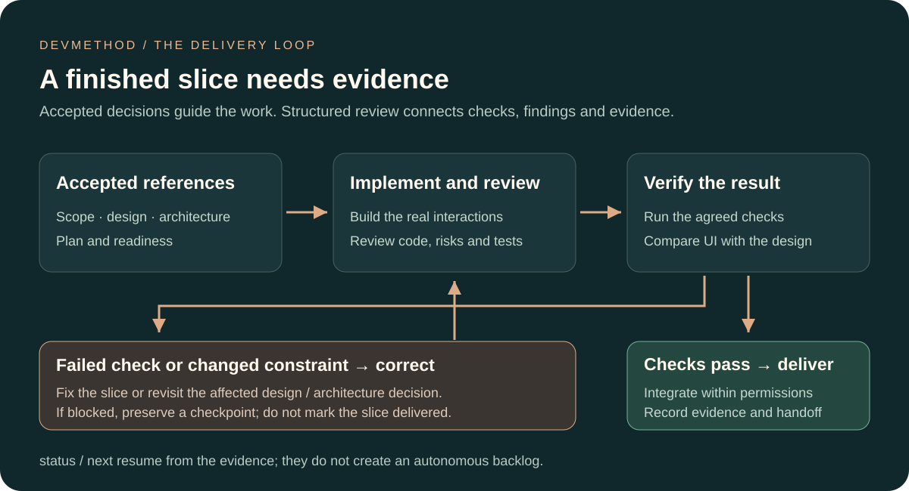

# DevMethod

From idea to delivery with your AI coding agents.

A reusable method for human–AI collaboration, organized around missions and supported by verification evidence. Start from a need, discuss important decisions, implement a bounded scope, and preserve what was checked and what comes next.

**[▶ Watch the review interface in action — 73 seconds, French voice and subtitles](#review-your-changes-and-open-the-report)** · [What the recorded example demonstrates](docs/media/review-r02/README.md)

[](https://www.npmjs.com/package/devmethod-ai) [](LICENSE) [](https://github.com/montassarkhalloufi/DevMethod/actions/workflows/platform-tests.yml)

## Watch DevMethod build Lisière, then inspect a review — 4 min 03 s

[](https://github.com/montassarkhalloufi/DevMethod/raw/refs/heads/main/docs/media/visual-chain/devmethod-du-besoin-au-produit-4k.fr.mp4)

**[▶ Watch the video — 4K, French narration](https://github.com/montassarkhalloufi/DevMethod/raw/refs/heads/main/docs/media/visual-chain/devmethod-du-besoin-au-produit-4k.fr.mp4)** · [Subtitles and execution evidence](docs/media/visual-chain/README.md) · [Download the working prototype](https://github.com/montassarkhalloufi/DevMethod/raw/refs/heads/main/docs/media/visual-chain/lisiere-visual-source.zip)

**Existing Lisière film, extended with the new review interface.** The original footage is retained, with an added narrated chapter showing real interface captures and a clearly fictional review example.

**Concrete example: Lisière, a personal reading library.** Start with an idea, compare three visual directions, approve a master screen, derive the other screen images, choose a suitable architecture, then build and verify the application.

| Step shown | Concrete result |
| --- | --- |
| Explore and frame | Add books, filter readings and track three statuses |
| Design | Three alternatives → selected editorial master → add-book and completed-reading images |
| Architecture | HTML/CSS/JavaScript, testable book rules and browser-local storage |
| Plan, ready and implement | Working form, filters, status changes and saved books |
| Review and verify | Corrected alert/focus behavior, 6 tests and real Chrome desktop/mobile journeys |
| New review chapter | Find and filter findings, inspect evidence/corrections, distinguish coverage, inspect sources and export |
| Integrate and handoff | Local prototype, references, evidence and resumption context |

The video uses illustrative Codex commands with real generated images and recorded application interactions. DevMethod guides the coding agent; image generation requires an available host tool. The visual workflow is included in npm 0.2.0. [Follow the visual workflow](docs/VISUAL-WORKFLOW.md).


DevMethod exposes fourteen `devmethod-*` workflow commands in the agent’s skill menu. The six procedure modules and existing `project-foundation <stage>` invocations remain supported.

A reusable workflow for taking a software project from exploration to delivery: decisions, UX, architecture, tickets, development, tests, review and handoff. Six focused skills support fourteen workflow stages, each ending with evidence, limitations and one suggested next command.

**DevMethod 0.4.1.** [Complete review-to-report flow](docs/RELEASE-0.4.1.md) · [0.3 workflow changes](docs/RELEASE-0.3.0.md). This release completes review generation and opening inside the agent, with an installed offline renderer. Review guidance now follows sensitive-data outputs, failure recovery and affected contracts beyond the diff; [detection evaluation](evaluation/review-detection/README.md) separates reproducible defects from measured reviewer results. Check the registry and GitHub release for publication evidence.

For developers and small teams using coding agents in new or existing repositories. Requires Node.js 22+ and npm; Git is required for context provenance. Application examples have separate framework/database prerequisites. DevMethod records scope, decisions and verification; it does not certify agent output, infer all dependencies, deploy applications or run an autonomous backlog. Installation and deterministic fixture results are separate from native host validation. See [compatibility](COMPATIBILITY.md).

Start with [missions and the tested source quick start](docs/MISSIONS.md), the [tested from-zero Pocket Tasks project](examples/pocket-tasks/README.md), then the [complete Next.js/NestJS example](examples/fullstack/README.md). Advanced references: [context and sizing](docs/MISSIONS.md), [safe updates](docs/UPDATES.md), [resumption](docs/RESUMPTION.md), [optional stack profiles](docs/STACK-PROFILES.md), [bounded manual planning](docs/ORCHESTRATION.md), [troubleshooting](docs/TROUBLESHOOTING.md), and [release status and evidence](docs/RELEASE-0.1.0.md).

## Why this method?

DevMethod grew from its creator’s own AI-assisted development practice: making the same way of working reusable across projects. The creator did not know BMAD when the idea began and discovered it afterwards. That origin explains the project; it is not evidence of uniqueness or superiority.

The central unit is a **mission with an observable outcome**. Larger missions can use milestones and coherent tickets; small changes can stay inline. Discuss decisions before dependent work, keep uncertain plans conditional, connect acceptance criteria to executed checks, and leave a dated handoff. The method does not require sprints and can fit an existing team process.

BMAD explicitly describes agile AI-driven development and includes specs, epics, stories, sprint planning and retrospectives. Its current planning guidance is also proportionate and supports small changes. DevMethod shares several of those principles; this positioning does not claim that BMAD lacks decisions, evidence or resumability. See [BMAD’s own planning documentation](https://docs.bmad-method.org/plan/choose-a-planning-path/).

For visual work, DevMethod can guide comparable alternatives, an approved master image, derived screens and an interactive prototype when useful. Image generation requires a host tool. The review viewer separately exposes recorded findings, evidence, corrections, coverage and sources; it is not an annotation-and-approval tool for individual screens. Try one bounded task and assess clarity, evidence and ease of resumption. No comparative productivity or cost advantage is established.

## Install in a project

Requires Node.js 22+ and npm. Install into a fresh staging directory first:

```bash
npx --yes devmethod-ai@0.4.1 init --tool codex --dest ../foundation-staging
```

Choose `codex`, `claude` or `cursor`. If you omit `--tool`, an interactive terminal asks. For example:

```bash
npx --yes devmethod-ai@0.4.1 init --tool claude --dest ../foundation-staging --dry-run
```

Remove `--dry-run` to write. Select a subset with `--modules decision-architecture,scoped-delivery`; `project-foundation` is always included. Without `--modules`, all six modules are installed. The installer refuses divergent files and duplicate skills across host directories. It never edits AGENTS.md, CLAUDE.md or your package.json. Review the staging output, then merge only what the project needs.

The installer has no runtime dependencies and makes no network requests after npm obtains the package. To pin the final version, use `npx --yes devmethod-ai@0.4.1 init ...`. To pin a reviewed repository commit instead, use: `npx --yes --package=github:montassarkhalloufi/DevMethod#<commit-sha> devmethod init ...`.

Complete PROJECT_PROFILE.md with your real stack, commands, scope, deployment permissions and data requirements. Merge AGENTS.foundation.md into the project's existing instructions only after review. Claude Code reads CLAUDE.md: preserve its current content and, if the project has AGENTS.md, optionally add `@AGENTS.md` to import it. Keep existing accepted architecture decisions authoritative.

The installer includes `DEVMETHOD-LICENSE` so it preserves your application's LICENSE. Retain that MIT notice with redistributed copies. Repository-level release documents and the CLI are not copied into your application.

Installation copies the reusable method and blank templates, not another project's context. Preserve filled profiles, decisions, tickets and instruction files separately. Manifest hashes describe the initial installation; local template customization is expected to change them. To install elsewhere, run the CLI again.

## Verify the source checkout

From a reviewed source checkout:

```sh
npm ci
npm test
npm run check:docs
npm pack --dry-run
node dist/cli.js init --tool codex --dest ../candidate-staging
node dist/cli.js doctor --dest ../candidate-staging --json
node dist/cli.js update-preview --dest ../candidate-staging --json
```

The package includes advanced docs and fictional examples. `init` copies only the skills and adoption templates, preserving the application. Read the package docs from its checkout or extracted tarball. The core CLI has no runtime dependencies; example applications install their own pinned dependencies separately.

## Inspect an adopted installation

From a reviewed source checkout, inspect an installed project without changing it:

```bash
node dist/cli.js doctor --dest /path/to/project --json
```

Doctor reports missing files, changes from the initial manifest and duplicate host copies. Customized profiles and skills produce warnings; they are preserved. It does not execute an agent or certify application quality. See [diagnostic codes and exit statuses](docs/DOCTOR.md).

## Choose the amount of process

The stages below are available entry points, not fourteen mandatory conversations.

| Path | Typical work | Expected process |
|---|---|---|
| Quick | Clear bug fix inside existing contracts | Inline readiness, implementation, focused verification and review |
| Standard | Feature spanning components or sessions | Ready slice, relevant contracts, checks and resumable evidence |
| Major | New product decisions or consequential architecture changes | Resolve decisions, split into slices, verify integration |

Risk and repository policy override apparent size. Reuse accepted UI, architecture and project context; only fill actual gaps. See [work sizing](.agents/skills/project-foundation/references/work-sizing.md) and [starter exercises](examples/README.md).

## Run the workflow

In Codex: select `$devmethod-status` or `$devmethod-review TASK-1`.

In Claude Code or Cursor: select `/devmethod-status` or `/devmethod-review TASK-1`.

After installation, these commands run the workflow in your agent without npx. For example, `$devmethod-review` inspects actual changes, runs relevant checks and reports findings; it does not merely open the viewer. Existing `project-foundation <stage>` syntax remains valid. Partial module installs expose only stages supported by the selected modules. See [command discovery and updates](docs/COMMANDS.md).

Select an action below and add its target. These are prompts to the skill, not shell commands or standalone `/verify` commands. They do not create a background autonomous loop.

| Action | Result |
|---|---|
| `devmethod-explore` | Dated research on existing solutions, uncertainty and next direction |
| `devmethod-frame` | Product scope, exclusions and success measures |
| `devmethod-design` | Visual directions, selected mockups and UX criteria; image tooling depends on the host |
| `devmethod-architecture` | Conversation and explicit choice/delegation before dependent detail |
| `devmethod-plan` | Useful scope discussion, conditional milestones and near-term tickets |
| `devmethod-ready TASK-1` | Readiness assessment before implementation |
| `devmethod-implement TASK-1` | Scoped code, tests and corrections |
| `devmethod-review TASK-1` | Evidence-backed inspection, structured findings, checks, sources and report |
| `devmethod-verify TASK-1` | Executed checks and remaining gates |
| `devmethod-integrate TASK-1` | Delivery under existing permissions |
| `devmethod-correct-course` | Resolve changed scope or blocked decisions |
| `devmethod-next` | Select the next authorized slice |
| `devmethod-status` | Current evidenced implementation status |
| `devmethod-handoff` | Resumable checkpoint |

See [research, decision dialogue and mission migration](docs/WORKFLOW-0.3.md). See the [full command contract](.agents/skills/project-foundation/references/operating-commands.md). A failed check returns to correction; a blocked gate leads to handoff or replanning. Tests, code review and native permissions remain necessary.



## More recorded examples

[Detailed recorded Lisière chain](docs/media/full-chain-4k/README.md) · [Short Clair demo](docs/media/from-zero/README.md) · [Run Clair](examples/clair-from-zero/README.md). Clair is a separate from-zero example. The featured film retains the Lisière story and adds an explicitly separate fictional review example.

## Review your changes and open the report

https://github.com/user-attachments/assets/0dc7db4d-4789-47b7-a20b-1348049429c4

**[Download the MP4 — 1 min 13 s, French narration](https://github.com/montassarkhalloufi/DevMethod/raw/refs/heads/main/docs/media/review-r02/review-r02.fr.mp4)** · [Subtitles, chapters and provenance](docs/media/review-r02/README.md)

Follow R-02 in Réservation Lab: an unauthorized cross-building booking, its recorded test evidence, the proposed correction and the checks to rerun. Real interface captures with an animated cursor and French subtitles. This controlled exercise contains intentional defects; the finding remains open, with no verified correction.

In your coding agent, ask:

```text
$devmethod-review the current changes, then open the report
```

In Claude Code or Cursor, use `/devmethod-review` with the same request. The agent inspects the actual changes, runs relevant checks, records evidence-backed findings and justified impact, then generates the Markdown and interactive HTML reports from the real review JSON and opens the HTML. You do not need to launch npx, a terminal command or a server. The renderer is installed with scoped-delivery and runs locally with Node.js 22+.

For a small review without a requested report, the result can stay in the conversation. On a headless machine or if browser opening fails, the generated artifacts are preserved and linked with the opening limitation. Existing reports are never overwritten. See [review workflow and report delivery](docs/REVIEWS.md).

The screenshots below use clearly fictional data to illustrate the interface; your review uses actual project results. The separate terminal viewer remains available for manual use and demos, as described in the [review guide](docs/REVIEW-GUIDE.md).

[](https://github.com/montassarkhalloufi/DevMethod/raw/refs/heads/main/docs/media/review-r02/review-r02.fr.mp4)

*Static interface preview. Use the video player above to watch the R-02 walkthrough, which uses a separate controlled example. The linked MP4 remains available for download.*

**[Follow the review walkthrough](https://github.com/montassarkhalloufi/DevMethod/blob/main/docs/REVIEW-GUIDE.md)** · [JSON, Markdown and HTML example](https://github.com/montassarkhalloufi/DevMethod/tree/main/examples/review) · [Review chapter provenance](https://github.com/montassarkhalloufi/DevMethod/blob/main/docs/media/review-extension/README.md)

The example contains two fictional findings and three separate checks. Severity, confidence and resolution remain distinct. Sources show whether they were actually consulted. The same structured record produces the UI and reports; tickets reference stable finding IDs.


## Visual design and architecture

DevMethod connects art-direction selection, an approved master screen, derived image mockups and browser fidelity checks with technology and architecture decisions. Follow the [visual workflow guide](docs/VISUAL-WORKFLOW.md) and [recorded Lisière pilot](examples/visual-pilot/README.md). These capabilities are included in npm 0.2.0; npm 0.1.0 predates them. See the [0.2.0 release record](docs/RELEASE-0.2.0.md) for publication status.

## Included modules

`project-foundation`, `decision-architecture`, `design-to-code`, `react-feature-engineering`, `reliable-ai-integration`, `scoped-delivery`.

Use the modules your project needs. Adapt the workflow to your stack, architecture and delivery process.

## Where DevMethod can improve

The target is a compact engineering workflow for verifiable changes in existing repositories. BMad already documents adaptive planning, existing-codebase workflows and broader automation; DevMethod has not demonstrated parity or superiority. Read the [sourced comparison](docs/BMAD-COMPARISON.md), [prioritized roadmap](docs/ROADMAP.md), and [evaluation protocol](docs/EVALUATION.md). We aim to measure correct outcomes, honest evidence, context cost and reliable resumption under matched conditions.

## Demo material

The workflow illustration above is kept in the repository as an SVG so it remains reviewable and usable in dark mode. Try the [runnable bug-fix exercise](examples/README.md), which includes an intentionally failing baseline and an explicit task. It is a fixture, not a recorded model success. A real demonstration should preserve the observed failures, changes and checks; use the [native smoke protocol](COMPATIBILITY.md#native-smoke-protocol) to assess the host workflow.

## Verify and contribute

```bash
npm ci
npm test
npm pack --dry-run
```

Read [CONTRIBUTING.md](CONTRIBUTING.md), [COMPATIBILITY.md](COMPATIBILITY.md), and the [release checklist](docs/RELEASE-CHECKLIST.md). Licensed under [MIT](LICENSE).

A bounded [native Codex pilot](docs/NATIVE-PILOT-RESULTS.md) now records actual fixture execution and independent review. It covers one matched B1 triple and two DevMethod probes, not a completed comparative campaign or general autonomous dispatch.
