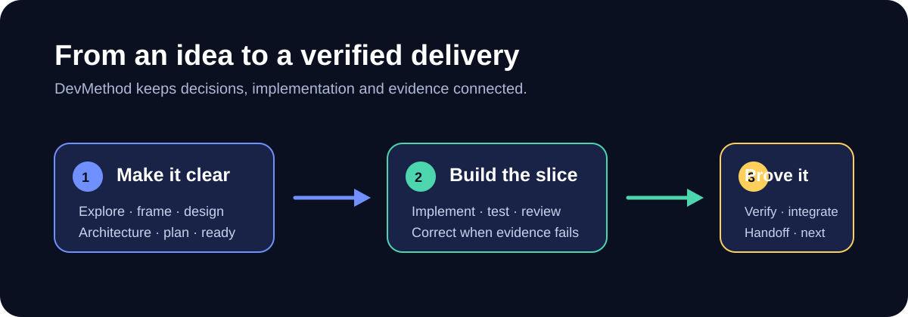
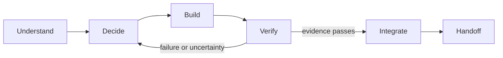

# DevMethod

From idea to delivery with your AI coding agents.

[](https://www.npmjs.com/package/devmethod-ai) [](LICENSE) [](https://github.com/montassarkhalloufi/DevMethod/actions/workflows/platform-tests.yml)



DevMethod is the public name of the kit. Its entry-point skill remains `project-foundation`, preserving existing invocations and the six-module structure.

A reusable workflow for taking a software project from exploration to delivery: decisions, UX, architecture, tickets, development, tests, review and handoff. Six focused skills support fourteen workflow stages, each ending with evidence, limitations and one suggested next command.

**0.1 release candidate, published on npm.** Installation profiles are provided for Codex, Claude Code and Cursor. Native authenticated Claude Code and Cursor sessions have not been validated yet. See [compatibility and smoke tests](COMPATIBILITY.md). The current skills and templates are primarily in French; they can follow the user's requested language.

## Install in a project

Requires Node.js 22+ and npm. Install into a fresh staging directory first:

```bash
npx --yes devmethod-ai init --tool codex --dest ../foundation-staging
```

Choose `codex`, `claude` or `cursor`. If you omit `--tool`, an interactive terminal asks. For example:

```bash
npx --yes devmethod-ai init --tool claude --dest ../foundation-staging --dry-run
```

Remove `--dry-run` to write. Select a subset with `--modules decision-architecture,scoped-delivery`; `project-foundation` is always included. Without `--modules`, all six modules are installed. The installer refuses divergent files and duplicate skills across host directories. It never edits AGENTS.md, CLAUDE.md or your package.json. Review the staging output, then merge only what the project needs.

The installer has no runtime dependencies and makes no network requests after npm obtains the package. To pin the published candidate, use `npx --yes devmethod-ai@0.1.0-rc.1 init ...`. To use a reviewed repository commit instead, use `npx --yes --package=github:montassarkhalloufi/DevMethod#<commit-sha> devmethod init ...`.

Complete PROJECT_PROFILE.md with your real stack, commands, scope, deployment permissions and data requirements. Merge AGENTS.foundation.md into the project's existing instructions only after review. Claude Code reads CLAUDE.md: preserve its current content and, if the project has AGENTS.md, optionally add `@AGENTS.md` to import it. Keep existing accepted architecture decisions authoritative.

The installer includes `DEVMETHOD-LICENSE` so it preserves your application's LICENSE. Retain that MIT notice with redistributed copies. Repository-level release documents and the CLI are not copied into your application.

Installation copies the reusable method and blank templates, not another project's context. Preserve filled profiles, decisions, tickets and instruction files separately. Manifest hashes describe the initial installation; local template customization is expected to change them. To install elsewhere, run the CLI again.

## Run the workflow

In Codex: `$project-foundation status`.

In Claude Code or Cursor: `/project-foundation status`.

Replace `status` with an action below. These are prompts to the skill, not shell commands or standalone `/verify` commands. They do not create a background autonomous loop.

| Action | Result |
|---|---|
| `explore` | Problem, users, alternatives and constraints |
| `frame` | Product scope, exclusions and success measures |
| `design` | UX direction and acceptance criteria |
| `architecture` | Decisions, boundaries and contracts |
| `plan` | Milestones and tickets with dependencies |
| `ready TASK-1` | Readiness assessment before implementation |
| `implement TASK-1` | Scoped code, tests and corrections |
| `review TASK-1` | Diff and architecture review |
| `verify TASK-1` | Executed checks and remaining gates |
| `integrate TASK-1` | Delivery under existing permissions |
| `correct-course` | Resolve changed scope or blocked decisions |
| `next` | Select the next authorized slice |
| `status` | Current evidenced implementation status |
| `handoff` | Resumable checkpoint |

See the [full command contract](.agents/skills/project-foundation/references/operating-commands.md). A failed check returns to correction; a blocked gate leads to handoff or replanning. Tests, code review and native permissions remain necessary.



## Included modules

`project-foundation`, `decision-architecture`, `design-to-code`, `react-feature-engineering`, `reliable-ai-integration`, `scoped-delivery`.

Use the modules your project needs. Adapt the workflow to your stack, architecture and delivery process.

## Where DevMethod can improve

The objective is not to imitate another workflow. It is to become more dependable in daily projects: host-validated installation, explicit project context, evidence-based delivery and clear recovery when a check fails. See the public [roadmap](docs/ROADMAP.md).

## Demo material

The workflow illustration above is kept in the repository as an SVG so it remains reviewable and usable in dark mode. A recorded demonstration should show a real project and its actual checks; until one is recorded, the [native smoke protocol](COMPATIBILITY.md#native-smoke-protocol) is the honest demonstration script.

## Verify and contribute

```bash
npm ci
npm test
npm pack --dry-run
```

Read [CONTRIBUTING.md](CONTRIBUTING.md) and [COMPATIBILITY.md](COMPATIBILITY.md). Licensed under [MIT](LICENSE).
