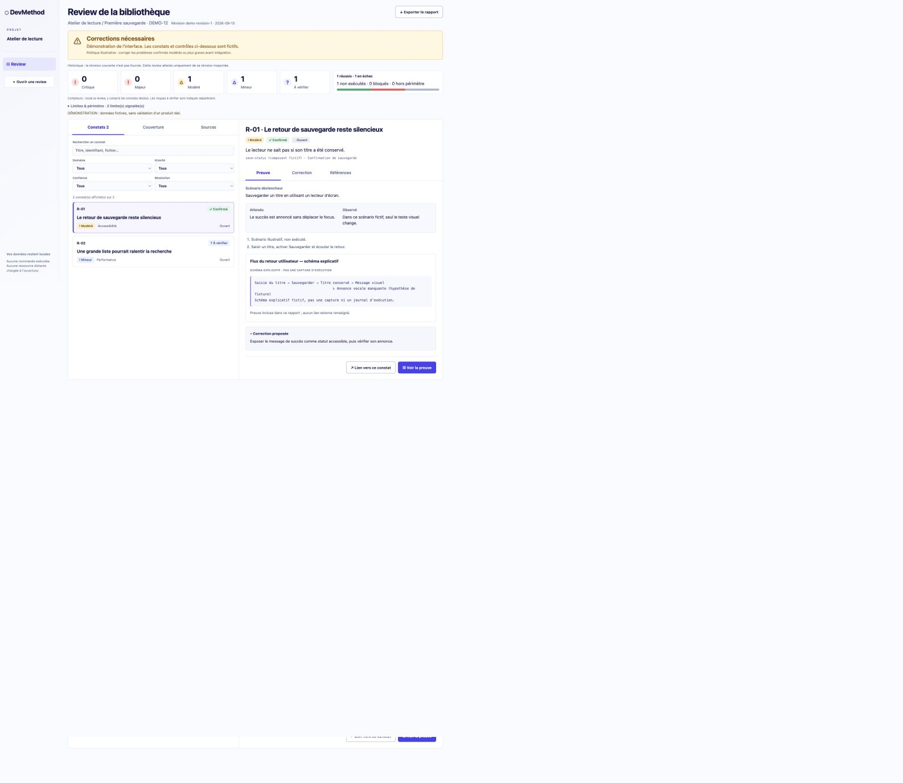
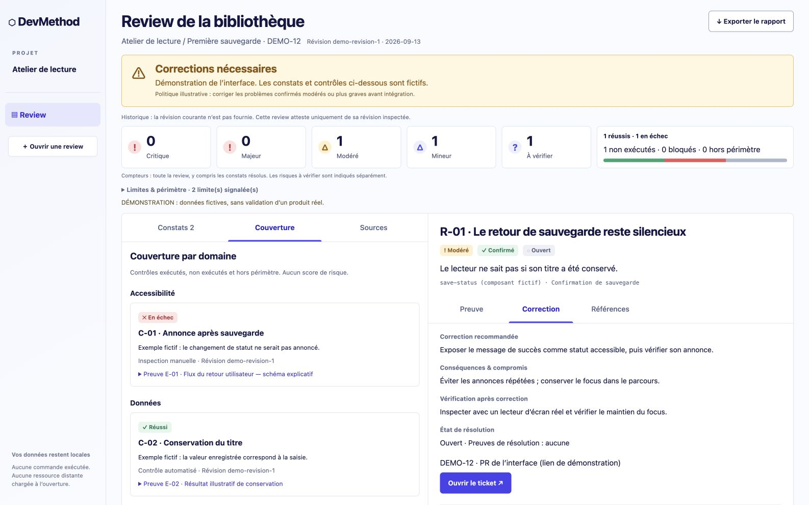
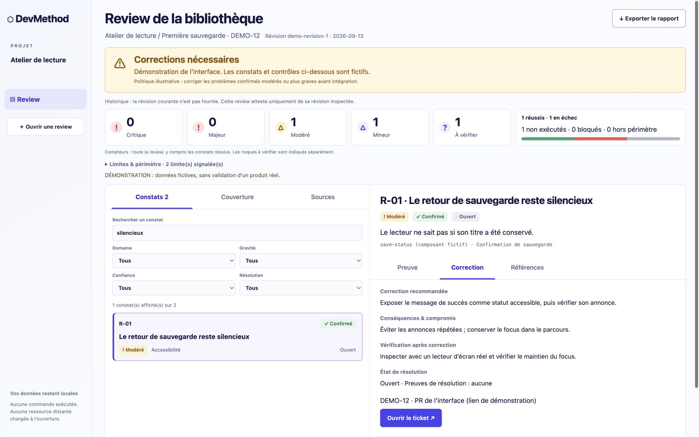

# From a review record to the browser

DevMethod 0.3 adds a review workflow and an offline browser interface. Version 0.3.1 expands the documentation and the existing narrated film with this journey. The CLI presents recorded results; it does not inspect code or run tests on your behalf.

## Review and open your real results

Use `$devmethod-review the current changes, then open the report` in Codex, or `/devmethod-review` with the same request in Claude Code/Cursor. The agent inspects the work and executes relevant checks, records actual findings and limits, generates JSON/Markdown/HTML, and opens the report. The renderer ships with scoped-delivery: no user-run npx command or server is needed. Browser opening failures retain the files and are reported separately from review findings. See [the complete flow](REVIEWS.md).

The following terminal example is only a manual tour of fictional data, not the main workflow.

## Try the packaged example

Use Node.js 22+ from a normal project directory, with a fresh output filename:

```sh
npx --yes devmethod-ai@0.3.1 review --demo --output review-demo.html --open
```

The OS opens the generated standalone HTML in your browser. No local server, account or source checkout is required. npx may download the package first. On a headless system, omit `--open` and transfer the HTML to your desktop. If automatic opening fails, the output is preserved for manual opening. Paths containing symlink components are rejected; on macOS use the canonical `/private/tmp/...` instead of `/tmp/...` for a temporary `--dest`.

The **Atelier de lecture** record is deliberately fictional. It contains two illustrative findings: a confirmed moderate accessibility problem and an unverified minor performance risk. Its three checks have separate outcomes: one passed, one failed, one not executed. They are not findings from the Lisière pilot or evidence that this fictional product was tested.



1. In **Constats**, search for `silencieux`. One finding remains; the severity and coverage cards still describe the whole review.
2. Select **R-01**. **Preuve** explains its trigger, expected and observed behavior, and labels its explanatory diagram.
3. Open **Correction** for the proposed change, trade-offs and required verification. A ticket link is shown only when supplied; the demo's link is explicitly illustrative.
4. Open **Couverture** to distinguish check outcomes and reasons for missing verification. Counts of tests and findings are independent.
5. Open **Sources** to inspect version, provenance, consultation and limits. The example's reference is marked **non vérifiée**, not presented as research actually performed.
6. Use **Exporter le rapport** for HTML, Markdown or JSON. The HTML snapshot retains selection, filters and detail section. Open your exported file again to resume; a different inspected revision still requires reassessment of affected evidence.
7. On mobile, return from the detail to the list without losing your filters. Keyboard focus and text labels complement the severity colors.





## Produce a real review

Within the coding agent, ask the workflow to review the authorized ticket. This is an illustrative skill request, not a CLI command or a claimed recorded agent run:

```text
$project-foundation review TASK-1
Inspect the actual stack and versions, the diff, accepted decisions and ticket criteria.
Consult applicable official sources and verify the provenance of any suggested skill.
Record checks, findings, evidence, limitations and the inspected revision in review.json.
Fix confirmed issues within the authorized scope, then record their new verification.
```

For a substantial review, use one results owner:

```text
docs/missions/first-save/reviews/review-01/
  review.json       # validated, versioned results
  REVIEW.md         # generated from those results
  preuves/          # only necessary, reviewed evidence
```

The [format contract](REVIEWS.md) defines required fields and path/link/privacy boundaries. Start from the [complete fictional JSON](../examples/review/review.json) to understand the shape, replacing **all** illustrative facts with actual observations. Do not label a suspect risk confirmed or a known source consulted without evidence. A failed check and a finding are different objects. Tickets reference finding IDs rather than copying their content.

```sh
npx --yes devmethod-ai@0.3.1 review \
  --review docs/missions/first-save/reviews/review-01/review.json \
  --output review-first-save.html \
  --markdown docs/missions/first-save/reviews/review-01/REVIEW.md \
  --open
```

Output files must be new; select another name if a report exists. The [packaged example](../examples/review/README.md) also contains generated HTML and Markdown for comparison. Existing Markdown can be opened with `--legacy path/to/REVIEW.md`; missing structured fields remain unknown.

## Watch the journey

The [extended existing 4K film](media/visual-chain/README.md) retains the Lisière footage and narration, then inserts a review-interface chapter before the original conclusion. The added chapter is a narrated montage of actual browser screenshots, not a continuous screen recording or a fresh review of Lisière. [Montage sources and provenance](media/review-extension/README.md).

The [verification record](REVIEW-VALIDATION.md) distinguishes automated tests, real browser observations and illustrative workflows. Export bytes and state were inspected; direct `file://` reopening was blocked by the browser tool, so that end-to-end check is not claimed as passed. Automatic redaction is heuristic: inspect evidence before distributing it.
