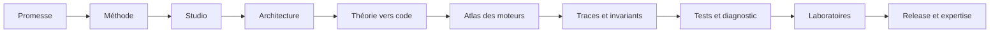

# Commencer ici — comprendre et maintenir DevMethod

Ce portail est le point d'entrée recommandé pour découvrir DevMethod. Il mène d'une première
lecture du produit jusqu'aux contrats que doit maîtriser une personne responsable de son
évolution. Les ADR et dossiers de mission restent les sources historiques ; ce portail les relie
sans les remplacer.

**Préférez une lecture visuelle ?** Ouvrez le
[manuel HTML navigable et illustré](handbook/index.html). Il fonctionne hors ligne, propose une
recherche et conserve votre progression uniquement dans votre navigateur.

> Référence documentée : Studio `0.6.0-beta.1`, branche d'intégration inspectée au commit
> `ef539e5`. Cette version est une candidate locale non publiée comme version stable. Vérifiez le
> registre, la branche et les preuves de release avant toute affirmation de disponibilité.

## Les quatre choses à distinguer

| Élément | Rôle | Ce qu'il ne fait pas |
| --- | --- | --- |
| **DevMethod** | Méthode de collaboration humain–agent fondée sur missions, décisions et preuves | Ne remplace pas le jugement, les tests ou les permissions humaines |
| **Skills `devmethod-*`** | Procédures installables qui guident l'agent à chaque étape | Ne sont pas un orchestrateur autonome ni un service distant |
| **CLI `devmethod`** | Installe, inspecte et vérifie des enregistrements locaux ; lance le Studio | N'exécute pas automatiquement un backlog et ne publie rien |
| **DevMethod Studio** | Espace local pour cadrer, construire, inspecter, vérifier et reprendre un projet | N'est ni un hébergeur cloud, ni une certification de qualité globale |

Le **Control Plane** appartient au Studio. Il relie les preuves, le risque, l'attention humaine et
l'autonomie effective. Il ne remplace ni les permissions MCP, ni les responsabilités, ni les
conditions d'application d'une version.

## Parcours selon votre objectif

### Je découvre le projet — 30 à 45 minutes

1. [Promesse et positionnement](product/PROMISE.md)
2. [État réel du produit](product/CURRENT-STATE.md)
3. [Vue d'ensemble de la méthode](method/OVERVIEW.md)
4. [Visite illustrée du Studio](studio/USER-GUIDE.md)
5. [Glossaire](product/GLOSSARY.md)

À la fin, vous devez pouvoir expliquer la différence entre une déclaration, une preuve, une
vérification et une permission.

### Je veux utiliser DevMethod — une demi-journée

1. [Workflow complet](method/WORKFLOW.md)
2. [Commandes visibles dans l'agent](COMMANDS.md)
3. [Missions et contexte](MISSIONS.md)
4. [Démarrer et utiliser le Studio](studio/USER-GUIDE.md)
5. [Comprendre le Control Plane](studio/CONTROL-PLANE.md)
6. Exécuter l'exemple [Pocket Tasks](../examples/pocket-tasks/README.md) puis l'exemple
   [Les Ateliers React](../examples/studio-ateliers-react/README.md).

### Je dois modifier le code — une à deux journées

1. [Architecture du système](architecture/SYSTEM-MAP.md)
2. [De la théorie au code](architecture/THEORY-TO-CODE.md)
3. [Atlas des sept moteurs](architecture/ENGINE-ATLAS.md)
4. [Carte du code et fichiers prioritaires](architecture/CODE-MAP.md)
5. [Dossiers de code annotés](maintainers/CODE-DOSSIERS.md)
6. [Flux de données et d'exécution](architecture/DATA-FLOWS.md)
7. [Environnement de développement](maintainers/DEVELOPMENT.md)
8. [Stratégie de test](maintainers/TESTING.md)
9. [Ajouter une fonctionnalité](maintainers/ADDING-A-FEATURE.md)

### Je deviens mainteneur — parcours expert

1. [Parcours de maîtrise](maintainers/LEARNING-PATH.md)
2. [Relier la méthode aux mécanismes exécutables](architecture/THEORY-TO-CODE.md)
3. [Maîtriser les sept moteurs](architecture/ENGINE-ATLAS.md)
4. [Suivre cinq requêtes de bout en bout](architecture/REQUEST-LIFECYCLE.md)
5. [Contrats et invariants à préserver](architecture/CONTRACTS-AND-INVARIANTS.md)
6. [Serveur Studio et API locale](studio/SERVER-API.md), puis
   [interface et état React](studio/FRONTEND-STATE.md)
7. [Dossiers de code annotés](maintainers/CODE-DOSSIERS.md)
8. [Recettes de changement vertical](maintainers/CHANGE-RECIPES.md)
9. [Playbook de diagnostic et récupération](maintainers/FAILURE-PLAYBOOK.md)
10. [Laboratoires exécutables et évaluation](maintainers/LABS-AND-ASSESSMENT.md)
11. [Release et compatibilité](maintainers/RELEASE.md)
12. [ADR acceptés](ADR-027-control-plane.md) en remontant vers les décisions liées
13. [Résultats du Control Plane](missions/control-plane/RESULTS.md) pour apprendre à distinguer
   maquette, implémentation, test automatisé et observation navigateur
14. [Contribuer](../CONTRIBUTING.md) et [preuves de compatibilité](../COMPATIBILITY.md)

Ce parcours représente environ une à deux semaines de lecture et de pratique pour une personne déjà
à l'aise avec TypeScript, Node et React. Il ne certifie pas automatiquement la maîtrise : le niveau
expert est démontré par les laboratoires, un changement réel relu et la capacité à diagnostiquer
sans casser les invariants.

## Carte de lecture rapide

Ne commencez pas par lire tous les ADR dans l'ordre. Commencez par ce portail, puis consultez une
décision lorsqu'elle possède le sujet que vous modifiez.

## Source de vérité par question

| Question | Source prioritaire |
| --- | --- |
| Que promet le produit ? | [Promesse](product/PROMISE.md) et README |
| Qu'est-ce qui fonctionne maintenant ? | [État actuel](product/CURRENT-STATE.md) et résultats de mission |
| Pourquoi cette architecture ? | ADR correspondant |
| Comment le code se comporte ? | Sources et tests de la révision inspectée |
| Qu'est-ce qui a été vérifié ? | Rapport de mission lié à un commit précis |
| Qu'est-ce qui est publié ? | Registre npm et dossier de release de la version exacte |

Une capture explique une interface. Elle ne prouve pas qu'un bouton fonctionne. Un test prouve le
cas qu'il exécute, pas tout le produit. Un document historique ne certifie pas une révision plus
récente.
