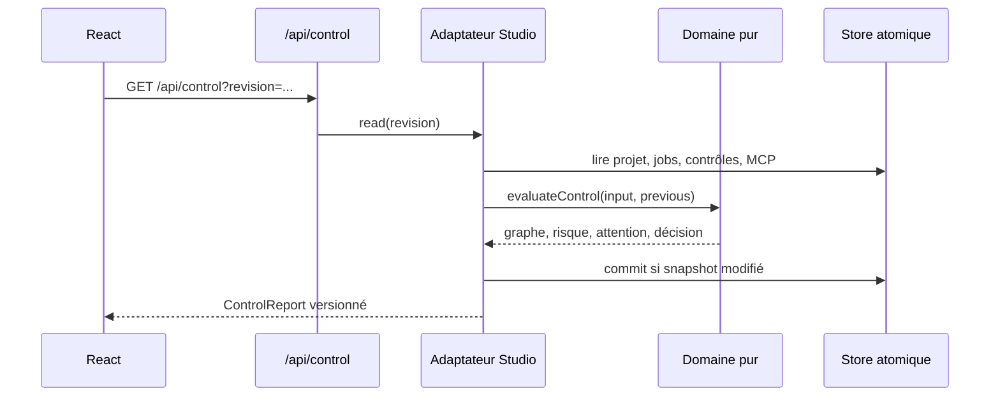

# Flux de données et d'exécution

## Lecture du Control Plane

## Décision humaine

La vue envoie version, clé de snapshot, élément, résolution et raison. Le serveur relit les sources,
refuse un snapshot obsolète, enregistre une intervention immuable puis recalcule. L'acceptation peut
lever un signal humainement résolvable mais ne remplace ni preuve manquante ni permission MCP.

## Lancement d'un contrôle

`POST /api/control/verify` accepte une révision, un identifiant de contrôle et un identifiant de
requête. Seuls les contrôles Studio exécutables sont lancés. Les contrôles externes renvoient une
instruction explicite. L'UI attend le journal réel avant d'afficher le résultat.

## Action MCP

Sélection, permission et admission Control Plane sont des gates séparées. Même une permission
`allow` ne permet pas une transmission automatique lorsque l'autonomie effective n'est pas
`Auto-Continue`. Une seconde admission juste avant l'appel protège contre un arrêt apparu pendant
la découverte.

## Application d'une candidate

La continuation vérifie la version et le snapshot, puis le domaine vérifie délégation, révision,
preuves, base, cadrage et absence de mission concurrente. Une candidate ne devient jamais active
uniquement parce qu'un job est terminé.
