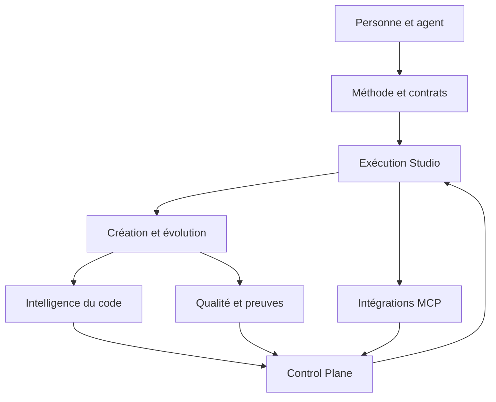
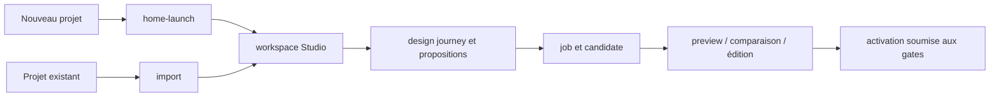
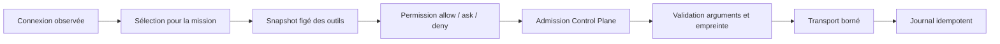

# Atlas des moteurs de DevMethod

Cet atlas décrit les sept ensembles qui font fonctionner DevMethod. Pour chacun, il donne sa
responsabilité, son chemin d'exécution, ses propriétaires, ses effets durables, ses pannes typiques
et les tests qui servent de première preuve. Il faut le lire avec la
[carte théorie → code](THEORY-TO-CODE.md) et les [dossiers de code](../maintainers/CODE-DOSSIERS.md).

## Vue d'ensemble



La flèche de retour signifie que le Control Plane **admet ou refuse une tentative**. Il ne remplace
pas les validations du domaine, la délégation, les permissions MCP ni la concurrence optimiste.

## 1. Moteur de méthode et de contrats

### Responsabilité

Décrire une mission, vérifier sa cohérence, planifier des tâches dépendantes, conserver un
checkpoint, rattacher les preuves à leurs sources et produire une conclusion honnête.

### Chemin principal

```text
skills installés → mission → plan → travail → preuves → checkpoint → closure/review
```

| Propriétaire | Rôle |
| --- | --- |
| `.agents/skills/` | procédures sources données aux agents |
| `src/commands.ts`, `src/init.ts` | catalogue et installation des modules |
| `src/mission.ts` | validation et statut de mission, capture de contexte |
| `src/planner.ts` | dépendances, isolation et tâches exécutables |
| `src/checkpoint.ts` | empreintes, fraîcheur et reprise |
| `src/evidence-*.ts` | contrats et exécution bornée des preuves |
| `src/guard*.ts` | gates locales et arrêt persistant optionnel |
| `src/review-model.ts`, `src/review-*.ts` | modèle, assainissement et rendu des reviews |

### Effets et pannes

- Effets : fichiers de mission choisis par le projet, checkpoints, rapports et état du guard.
- Pannes : mission incohérente, dépendance circulaire, empreinte modifiée, preuve non calibrée,
  reprise sur une source absente ou confusion entre rapport et état réel.
- Tests d'entrée : `mission`, `planner`, `checkpoint`, `evidence-runtime`, `guard`, `review`.

## 2. Moteur d'exécution du Studio

### Responsabilité

Composer le serveur local, posséder les transitions métier, sérialiser les mutations, gérer les
jobs et reprendre un registre valide après redémarrage.

### Chemin principal

```text
requête HTTP
  → route composée par server.mjs
  → service ou domaine
  → store.update(version attendue, transition)
  → validation ancien/nouvel état
  → écriture temporaire + renommage atomique
  → réponse versionnée
```

| Propriétaire | Rôle |
| --- | --- |
| `scripts/studio/server.mjs` | composition HTTP, sessions et modules optionnels |
| `scripts/studio/domain.mjs` | invariants et transitions du registre |
| `scripts/studio/store.mjs` | chargement, verrou, version et persistance atomique |
| `scripts/studio/jobs.mjs` | façade des transitions de job |
| `scripts/studio/runner.mjs` | revendication, processus agent et résultat |
| `scripts/studio/progress.mjs` | événements bornés déclarés par le worker |
| `scripts/studio/http.mjs` | limites et primitives HTTP communes |
| `scripts/studio/react-build.mjs` | compilation isolée d'un projet React autorisé |
| `scripts/build-studio-notices.mjs` | inventaire des notices du bundle Studio |

### Invariants et pannes

- une mutation part d'une version connue et une seconde écriture concurrente reçoit `409` ;
- une transition invalide n'est pas écrite ;
- un job actif interrompu au redémarrage n'est pas présenté comme réussi ;
- une progression déclarée ne devient pas une preuve de correction.

Premiers tests : `studio-domain`, `studio-store`, `studio-runner`, `studio-progress-http`,
`studio-integration-safety`.

## 3. Moteur de création et d'évolution

### Responsabilité

Créer ou importer un projet, conserver le cadrage et les décisions, produire des propositions,
montrer une candidate, permettre une édition bornée et activer seulement une révision recevable.

### Deux entrées



| Sous-système | Propriétaires | Preuves initiales |
| --- | --- | --- |
| accueil et création | `home-server.mjs`, `home-store.mjs`, `home-launch.mjs` | `studio-home-*` |
| import borné | `import-contract.mjs`, `import-paths.mjs`, `import.mjs` | `studio-import*`, `studio-paths` |
| conception | `design-journey.mjs`, `proposals.mjs` | `studio-proposals`, `studio-journey-ui` |
| aperçu | `preview.mjs`, `comparison-*` | `studio-comparison-preview`, `studio-runtime-source-ui` |
| édition | `editor.mjs`, `source.mjs` | `studio-editor*`, `studio-source*` |
| application | `domain.mjs` et Control Plane | `studio-integration-safety`, `studio-domain` |

Pannes typiques : chemin importé hors racine, source trop volumineuse, proposition devenue obsolète,
réponse de vérification tardive, base modifiée pendant l'édition, candidate non vérifiée ou choix
réservé non approuvé.

## 4. Moteur de compréhension du code

### Responsabilité

Construire une vue statique et bornée des fichiers, symboles, relations, architecture, flux et
impacts probables. Cette analyse aide à naviguer ; elle ne prouve pas le comportement runtime.

```text
manifestes d'une révision ou d'un brouillon
  → snapshot immuable
  → résolution des fichiers/imports
  → extraction AST
  → modèle projet
  → flux et impact
  → cache lié à l'empreinte
  → routes et vues Code
```

| Propriétaire | Rôle |
| --- | --- |
| `scripts/studio/intelligence.mjs` | snapshot, cache et façade |
| `scripts/studio/intelligence/ast.mjs` | extraction syntaxique bornée |
| `scripts/studio/intelligence/resolution.mjs` | résolution des relations |
| `scripts/studio/intelligence/model.mjs` | modèle de projet |
| `scripts/studio/intelligence/impact.mjs` | impact et dépendances probables |
| `studio-ui/src/features/code/` | vues du modèle et interactions |

Premiers tests : `studio-intelligence`, `studio-intelligence-http`, `studio-architecture-model`,
`studio-project-model-views`, `studio-code-widget`. Limites : langages pris en charge, code dynamique,
plugins de build, données runtime et appels réseau peuvent rester invisibles.

## 5. Moteur de qualité et de preuves

### Responsabilité

Déclarer les contrôles disponibles, décider s'ils sont exécutables localement ou demandés à
l'extérieur, lancer les adaptateurs autorisés et enregistrer un résultat lié à la bonne révision.

| Propriétaire | Rôle |
| --- | --- |
| `quality-catalog.mjs` | définitions et capacités annoncées |
| `quality-criteria.mjs` | exigences par contexte |
| `quality-adapters.mjs` | adaptateurs locaux explicitement autorisés |
| `quality-react.mjs` | compilation React isolée et allowlistée |
| `quality-external.mjs` | forme des demandes/résultats externes |
| `quality-storage.mjs` | journal et rattachement à la révision |
| `quality.mjs` | coordination, idempotence et exposition |

États à distinguer : absent, indisponible, demandé, en cours, réussi, échoué et périmé. Un succès
signifie seulement que ce contrôle, avec cette configuration, a observé ce résultat sur ce périmètre.

Premiers tests : `studio-quality`, `studio-quality-requests`, `studio-quality-widget`,
`studio-react-build`. Pannes : contrôle déjà actif, `requestId` réutilisé autrement, fournisseur
modifié, résultat trop ancien ou adaptateur absent.

## 6. Moteur d'intégrations MCP

### Responsabilité

Séparer connexion, sélection, permission, admission, validation, transport et journalisation pour
qu'aucun booléen général ne signifie à tort « tout est autorisé ».



| Propriétaire | Rôle |
| --- | --- |
| `mcp-manager.mjs`, `mcp-client.mjs` | cycle de connexion et observation |
| `mcp-oauth.mjs`, `mcp-network.mjs` | OAuth local et règles réseau |
| `mcp-selection.mjs`, `mcp-policy.mjs` | outils retenus et permissions |
| `mcp-schema.mjs` | validation des arguments |
| `mcp-broker.mjs` | admission, déduplication et appel |
| `mcp-actions*.mjs` | journal d'actions et décisions humaines |
| `mcp-store.mjs`, `mcp-usage.mjs` | stockage et mesure locale |
| `connector-guides*.mjs` | catalogue, préparation et routes des guides de connexion |
| `connector-interactions*.mjs` | questions, réponses et brouillons de configuration |

Premiers tests : `studio-mcp`, `studio-mcp-network`, `studio-mcp-broker`,
`studio-mcp-permissions`, `studio-mcp-storage`. Après timeout, annulation ou réponse perdue, l'effet
externe peut être inconnu : relire le journal et le fournisseur avant toute nouvelle écriture.

## 7. Moteur de contrôle

### Responsabilité

Transformer les observations disponibles en graphe de preuves, signaux de risque, demandes
d'attention et autonomie effective explicable.

| Propriétaire | Rôle |
| --- | --- |
| `src/control-plane/contracts.ts` | langage partagé |
| `src/control-plane/validation.ts` | validation stricte des rapports et entrées |
| `src/control-plane/graph.ts` | identité, dépendances et invalidation |
| `src/control-plane/policy.ts` | sévérité et priorité déterministes |
| `src/control-plane/engine.ts` | évaluation, historique et attention |
| `control-sources.mjs` | lecture des sources Studio |
| `control-observations.mjs` | conversion des observations |
| `control-plane.mjs` | coordination et snapshot |
| `control-routes.mjs` | frontière HTTP |
| `studio-ui/src/features/control/` | lecture et actions humaines |

Lire ensuite les [traces complètes](REQUEST-LIFECYCLE.md). Premiers tests : `control-plane`,
`studio-control-plane`, `studio-control-widget`, `studio-control-layout`.

## Comment localiser une modification

Pour toute évolution, remplir cette fiche avant de coder :

| Question | Réponse attendue |
| --- | --- |
| action visible | ce que fait la personne ou l'agent |
| moteur propriétaire | l'un des sept moteurs ci-dessus |
| contrat | type, schéma ou invariant qui borne l'entrée |
| règle | fonction pure ou transition qui décide |
| adaptateur | HTTP, filesystem, processus ou fournisseur |
| état durable | fichier ou journal écrit, ou absence d'effet |
| consommateur | interface, CLI, agent ou moteur suivant |
| test discriminant | test capable d'échouer si la promesse est cassée |
