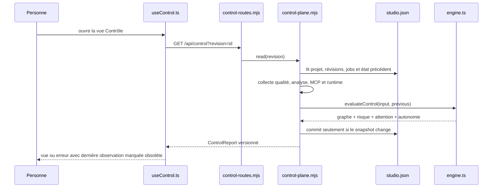
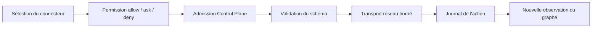

# Suivre une requête de bout en bout

Ce guide apprend à raisonner sur DevMethod par **traces**. Au lieu de lire les dossiers dans
l'ordre, on part d'une action visible, puis on suit son contrat, sa route, sa règle métier, sa
persistance, ses preuves et son retour dans l'interface.

## Trace 1 — charger le Control Plane



### Fichiers à ouvrir dans cet ordre

1. [`useControl.ts`](../../studio-ui/src/features/control/useControl.ts) — polling, annulation et
   validation minimale de la réponse ;
2. [`control-routes.mjs`](../../scripts/studio/control-routes.mjs) — origine, méthode, taille et forme
   autorisées ;
3. [`control-plane.mjs`](../../scripts/studio/control-plane.mjs) — collecte des sources réelles ;
4. [`engine.ts`](../../src/control-plane/engine.ts) — calcul pur et historique ;
5. [`store.mjs`](../../scripts/studio/store.mjs) — transition et persistance atomique.

### Points à savoir expliquer

- l'UI interroge toutes les trois secondes, mais annule une requête précédente avant un nouveau
  contexte ;
- une réponse doit exposer `schemaVersion: 1`, une décision et un tableau de nœuds ;
- lire le rapport peut provoquer un commit uniquement si le snapshot calculé diffère ;
- `version` protège l'état Studio ; `snapshotKey` protège le contexte de décision ;
- une erreur réseau ne rend pas la dernière réponse actuelle : l'interface la marque comme telle.

## Trace 2 — enregistrer une décision humaine

L'interface envoie `version`, `snapshotKey`, `itemId`, `resolution` et `reason`. La route refuse les
clés inconnues. L'adaptateur relit ensuite les sources avant de muter : une décision prise sur un
ancien snapshot reçoit `409`.

Dans [`resolveAttention`](../../src/control-plane/engine.ts), une décision n'est valide que si :

- l'élément appartient encore au `contextKey` courant ;
- l'action attendue vaut `decide` ;
- la résolution vaut `accept` ou `reject` ;
- la justification contient de 1 à 2 000 caractères ;
- aucune décision différente n'a déjà été enregistrée pour cet élément.

L'intervention est ajoutée à un journal. Elle peut lever un signal `humanResolvable` dans le même
contexte. Elle ne change jamais un nœud `missing`, `stale` ou `failed` en preuve favorable.

## Trace 3 — exécuter un contrôle

```text
clic Vérifier
  → useControl.runChecks
  → POST /api/control/verify
  → plane.verify
  → quality.runProjectQuality
  → journal de qualité lié à la révision
  → nouvelle lecture du Control Plane
  → recalcul de la décision
```

Seuls les nœuds qui possèdent `canRun` et `checkId` partent dans cette boucle. Une vérification
externe n'est pas simulée : le serveur demande d'ouvrir la procédure correspondante. `requestId`
sert à identifier une demande, mais il ne transforme pas un contrôle non exécuté en succès.

## Trace 4 — appliquer une candidate

L'application n'est pas la fin automatique d'un job. La chaîne est :

1. une demande produit un job ;
2. le worker revendique le job ;
3. le résultat produit une révision candidate ;
4. les contrôles sont attachés à cette révision ;
5. le Control Plane calcule l'autonomie effective ;
6. `continue` vérifie version et snapshot ;
7. [`continueVerifiedRevision`](../../scripts/studio/domain.mjs) réévalue les gates métier ;
8. la révision devient active uniquement si ces gates restent satisfaites.

Une décision `Auto-Continue` autorise donc une tentative dans les délégations existantes ; elle ne
constitue pas à elle seule l'application.

## Trace 5 — appel MCP

Un appel externe traverse des barrières indépendantes :



La permission appartient à [`mcp-policy.mjs`](../../scripts/studio/mcp-policy.mjs). L'admission
dépend de l'autonomie calculée. Le schéma, le réseau et le journal possèdent encore leurs propres
limites. Ne regroupez jamais ces contrôles sous un booléen générique `authorized`.

## Méthode de diagnostic par trace

Pour tout défaut, écrivez cinq lignes avant de modifier le code :

1. **entrée observable** — action, requête et version ;
2. **propriétaire du contrat** — type ou validation ;
3. **propriétaire de la règle** — fonction pure ou domaine ;
4. **effet durable** — fichier, journal ou absence d'écriture ;
5. **preuve attendue** — test capable d'échouer au bon niveau.

Si vous ne pouvez pas remplir une ligne, poursuivez la lecture de la trace : vous n'avez pas encore
localisé la frontière responsable.
