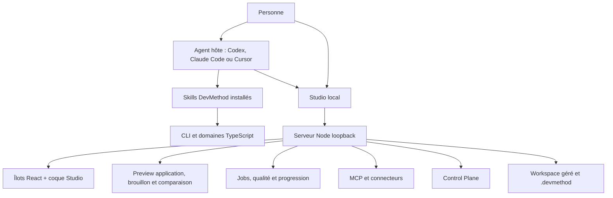

# Carte du système

## Vue de contexte

Le CLI et le Studio sont distribués ensemble, mais la méthode installable peut être utilisée sans
lancer le Studio. Les skills sont des instructions ; leur présence ne prouve pas leur découverte
ou leur exécution par un host donné.

## Couches

| Couche | Propriétaire | Dépendances admises |
| --- | --- | --- |
| Règles pures | `src/` et `src/control-plane/` | Bibliothèque standard, types internes |
| Adaptateurs Studio | `scripts/studio/` | Disque local, Git, HTTP loopback, domaines compilés |
| Interface | `scripts/studio/public/`, `studio-ui/src/` | API Studio et types partagés |
| Packaging | `src/init.ts`, scripts de build | Payload des skills et fichiers générés |
| Preuves | `tests/`, `docs/missions/*/evidence/` | Révision, procédure et environnement identifiés |

## Stores et données

Le Studio conserve un registre atomique versionné dans le workspace. Les mutations utilisent un
contrôle optimiste ; une décision prise sur un snapshot ancien reçoit un conflit. Les journaux de
progression, budgets et actions MCP restent séparés selon leur propriétaire. Le Control Plane
stocke snapshot, historique, transitions et interventions dans le registre existant plutôt que
d'introduire une base parallèle.

## Limites de confiance

- Le navigateur ne reçoit pas le token privé de l'agent hôte.
- Les mutations humaines exigent la même origine ; les routes worker sont bornées.
- Les arguments et sorties privées MCP ne sont pas copiés dans le graphe.
- Les projets importés restent des données non fiables : aucun script arbitraire n'est exécuté.
- Les analyses statiques et sondes runtime conservent leurs limites dans les résultats.

## Décisions propriétaires

Le Studio local est fixé par l'ADR 016, React par l'ADR 017, l'intelligence projet par l'ADR 018,
la progression par l'ADR 020, l'import par l'ADR 021, MCP par les ADR 024–026 et le Control Plane
par l'[ADR 027](../ADR-027-control-plane.md).
