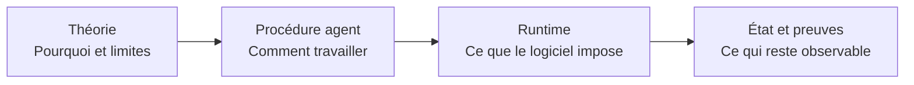

# De la théorie au code

Cette page empêche une confusion fréquente : DevMethod possède à la fois une **méthode de travail**,
des **procédures données à l'agent**, des **contrats exécutables** et une **interface locale**. Une
étape documentée n'est pas automatiquement une machine d'orchestration. Pour chaque notion, il faut
donc demander : qui l'explique, qui l'applique, où son état est conservé et quelle preuve permet de
contrôler son comportement ?

## Les quatre couches

| Couche | Autorité principale | Exemple | Ce qu'elle ne prouve pas |
| --- | --- | --- | --- |
| théorie | documentation de la méthode et ADR | une décision précède ses détails dépendants | que l'agent a suivi la règle |
| procédure | `.agents/skills/` | `devmethod-implement` demande une tranche vérifiée | que le code produit est correct |
| runtime | `src/`, `scripts/studio/` | le store refuse une version concurrente | que toutes les intentions sont satisfaites |
| état et preuve | `.devmethod`, tests et rapports | résultat lié à une révision | une certification globale du produit |

## Carte concept → implémentation → preuve

| Concept | Pourquoi il existe | Procédure propriétaire | Code ou contrat exécutable | État durable | Tests à lire |
| --- | --- | --- | --- | --- | --- |
| mission | borner un résultat autorisé | `project-foundation`, `scoped-delivery` | `src/mission.ts` | mission/checkpoint choisis par le projet | `mission`, `checkpoint`, `closure-loop` |
| cadrage | séparer besoin, scope et succès | `devmethod-frame` | validation de mission et registres Studio | brief, mission, plan | `mission`, `studio-domain` |
| décision | résoudre un choix avant ses dépendances | `decision-architecture` | propositions et transitions du domaine | ADR, décision Studio, journal | `studio-proposals`, `studio-domain` |
| délégation | dire quels choix peuvent être faits sans nouvel accord | profils et modes de travail | `effectiveDelegation`, gates d'application | délégation et approbations | `studio-integration-safety`, `studio-domain` |
| candidate | rendre le résultat inspectable avant activation | `scoped-delivery` | `finishJob`, editor et révisions | révision immuable et manifestes | `studio-runner`, `studio-editor` |
| preuve | relier une observation à une source et un périmètre | `devmethod-verify` | `evidence-*`, qualité et Control Plane | résultat, empreinte, fraîcheur | `evidence-*`, `studio-quality`, `control-plane` |
| risque | expliciter ce qui peut rendre l'action dangereuse | revue et architecture | `src/control-plane/policy.ts` | signaux et rapport Control Plane | `control-plane` |
| attention humaine | réserver une décision motivée au bon contexte | mode de collaboration | `resolveAttention` | intervention append-only | `control-plane`, `studio-control-plane` |
| autonomie effective | limiter l'action selon demande, risque et preuves | modes + règles de livraison | `evaluateControl`, admission des actions | décision et `snapshotKey` | `control-plane`, `studio-integration-safety` |
| reprise | restaurer le contexte sans élargir l'autorité | `devmethod-handoff`, `devmethod-next` | `checkpoint.ts`, récupération Studio | checkpoint, registre, journaux | `checkpoint`, `evidence-restart`, `studio-store` |
| arrêt | préserver un blocage et sa cause | bounded correction, guard | `guard.ts`, états terminaux des jobs | arrêt et diagnostics | `guard`, `studio-runner` |
| intégration | distinguer candidate, merge et publication | `devmethod-integrate` | CLI/package et gates du dépôt | commit, archive, registre externe | `install`, `update`, `package-smoke` |

## Ce que font réellement les quatorze étapes

Les étapes `devmethod-*` sont des compétences installables. Elles fournissent des instructions
spécialisées au modèle hôte. Elles ne constituent pas un scheduler central et ne garantissent pas
que le modèle les applique parfaitement.

| Famille | Étapes | Résultat attendu | Enforcement logiciel disponible |
| --- | --- | --- | --- |
| comprendre | explore, frame, design | incertitudes, périmètre et direction | validations de documents ou d'état lorsqu'elles existent |
| décider | architecture, plan, ready | choix, ordre et ticket exécutable | contrats de mission/plan ; aucune adoption automatique d'un ADR |
| livrer | implement, review, verify | changement, constats et preuves | tests, evidence runtime, guards et règles Studio |
| intégrer | integrate | candidate ou intégration autorisée | gates du dépôt et contrôles de version ; aucune publication implicite |
| reprendre | correct-course, next, status, handoff | état réconcilié et prochaine action | checkpoints et inspecteurs ; aucune nouvelle autorisation implicite |

## Exemple complet : une nouvelle règle de risque

1. **Théorie** : le risque doit rester explicable et une absence de preuve ne vaut pas succès.
2. **Décision** : préciser le signal, sa sévérité, sa réversibilité et les actions concernées.
3. **Contrat** : ajouter le type dans `src/control-plane/contracts.ts` si la forme change.
4. **Règle pure** : modifier `policy.ts` ou `engine.ts`, pas le composant React.
5. **Source** : collecter l'observation réelle dans `control-sources.mjs` ou
   `control-observations.mjs`.
6. **Adaptation** : relier cette source dans `scripts/studio/control-plane.mjs`.
7. **Présentation** : afficher le signal et son explication dans `studio-ui/src/features/control/`.
8. **Preuve** : ajouter un cas favorable, absent, périmé et bloquant dans les tests Control Plane.
9. **Observation** : vérifier dans le navigateur que la décision et l'attention restent lisibles.

Si une étape manque, la chaîne est incomplète : une carte UI seule n'est pas un signal, un signal
sans politique ne change pas la décision et une règle sans test ne possède pas de preuve de
régression.

## Questions de maîtrise

Une personne a compris cette frontière lorsqu'elle peut répondre à ces questions :

1. Cette règle relève-t-elle d'une consigne à l'agent ou d'un invariant exécutable ?
2. Quel fichier possède la décision et quels fichiers ne font que l'adapter ?
3. Quel état durable permet de reprendre après interruption ?
4. Quelle preuve deviendrait périmée si l'entrée ou la révision changeait ?
5. Quel test échouerait si la règle était retirée ?
