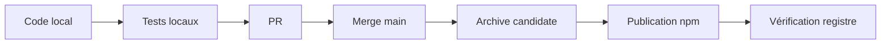

# Release, intégration et compatibilité

## États à ne pas confondre

Chaque flèche nécessite son autorisation et ses preuves. Une PR fusionnée n'est pas une publication.

## Candidate

Une candidate de release identifie version, commit, archive et digest. Elle inclut `dist/` reconstruit
depuis `src/`, le payload des skills et les dépendances nécessaires au Studio. Installez et testez
l'archive réelle, pas seulement le checkout.

## Gates minimales

- `npm ci`, `npm test`, lint, format et documentation ;
- `npm pack --dry-run` puis inspection de l'archive ;
- smoke du CLI emballé ;
- CI du commit exact sur les plateformes requises ;
- review mainteneur de l'archive exacte ;
- campagne native séparée pour les affirmations concernant un host.

Les tags `next` et `latest` suivent la politique de `CONTRIBUTING.md`. Ce guide n'autorise jamais une
publication. Lire la [checklist officielle](../RELEASE-CHECKLIST.md) et
[la compatibilité](../../COMPATIBILITY.md).
