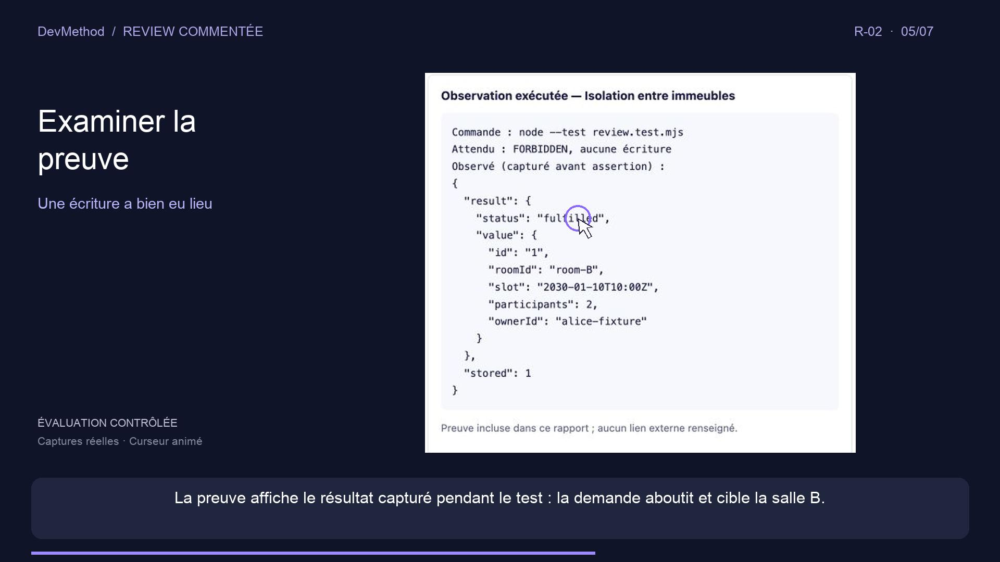

# R-02 — narrated review walkthrough

[Watch or download the MP4](https://github.com/montassarkhalloufi/DevMethod/raw/refs/heads/main/docs/media/review-r02/review-r02.fr.mp4) · [French subtitles](review-r02.fr.srt) · [Timed narration and chapters](scenes.json)

Duration: 72.65 seconds. 1920 × 1080, H.264, 24 fps, French synthesized narration (macOS Thomas), AAC audio. French subtitles are burned into the picture and included as a selectable track.

The seven scenes explain the verdict, finding R-02, triggering scenario, expected versus observed behavior, recorded evidence, proposed correction and required verification.

## Provenance and limits

Captured on 2026-09-13 from the local DevMethod review viewer, finding R-02, **Réservation dans un autre immeuble**, in Réservation Lab. The source report identifies revision `sha256-4371f623d0143a1ab28ba034d1d555b120f1915edab5edabefbbda773396991a`. The four original viewport screenshots are retained in [captures](captures).

This is a narrated montage of real screenshots with a composited animated cursor, not a continuous screen recording. The report describes a controlled experiment with intentional defects: the same assistant created the defective project and performed its review. It is not a blind benchmark. This video presents the report's recorded evidence; its production did not rerun the tests. R-02 remains open, with no resolution evidence. Authentication was outside the laboratory's tested scope.

Validation: full MP4 decode without errors, video/audio/subtitle stream inspection and visual checks of the verdict, evidence and final verification scenes. No independent human audiovisual review is claimed.
