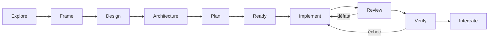

# Workflow de bout en bout

## Chaîne principale

Les étapes `correct-course`, `status`, `next` et `handoff` permettent d'ajuster, lire l'état,
sélectionner le prochain scope autorisé et reprendre une session.

## Contrat de chaque étape

| Étape | Question | Sortie utile |
| --- | --- | --- |
| Explore | Quelles solutions et incertitudes existent ? | Recherche datée et direction |
| Frame | Quel besoin, quelle portée et quel succès observable ? | Cadrage et exclusions |
| Design | Quelle expérience et quels états ? | Références visuelles et critères UX |
| Architecture | Quelles frontières et quels compromis ? | Choix explicite ou ADR |
| Plan | Dans quel ordre livrer de la valeur ? | Jalons et tickets exécutables |
| Ready | Le ticket est-il suffisamment défini ? | Dépendances et critères vérifiés |
| Implement | Quel changement borné répond au ticket ? | Code et contrôles ciblés |
| Review | Quels défauts ou risques sont observables ? | Findings localisés et preuves |
| Verify | Les critères ont-ils été réellement contrôlés ? | Résultats liés à la révision |
| Integrate | Le candidat respecte-t-il les gates ? | PR, merge ou blocage explicite |
| Correct course | Quelle décision a changé ? | Plans et preuves réconciliés |
| Next | Quel est le prochain scope déjà autorisé ? | Une slice, sans la commencer |
| Status | Quel est l'état prouvé ? | Progrès, lacunes et blocages |
| Handoff | Comment reprendre sans perdre le contexte ? | Checkpoint daté et action exacte |

## Boucles de correction

Un échec n'est pas effacé par une exécution verte ultérieure. Conservez le résultat, formulez une
hypothèse, changez quelque chose qui permet de la distinguer, puis réexécutez le contrôle affecté.
Deux échecs comportementaux identiques dans le guard optionnel provoquent un arrêt persistant.

## Intégration et publication

`integrate` ne signifie pas automatiquement fusion, déploiement ou publication. Ces actions suivent
les permissions courantes et les règles du dépôt. Pour ce projet, lisez `CONTRIBUTING.md` et la
[checklist release](../RELEASE-CHECKLIST.md).
