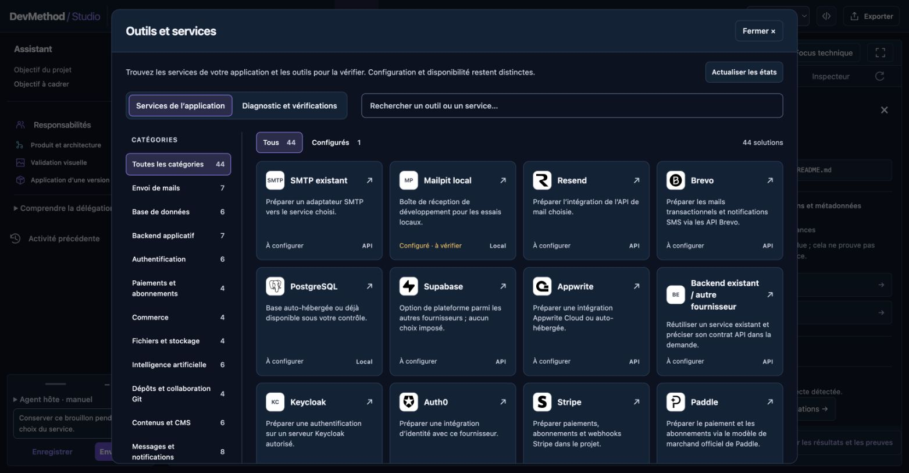
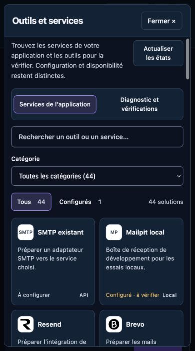
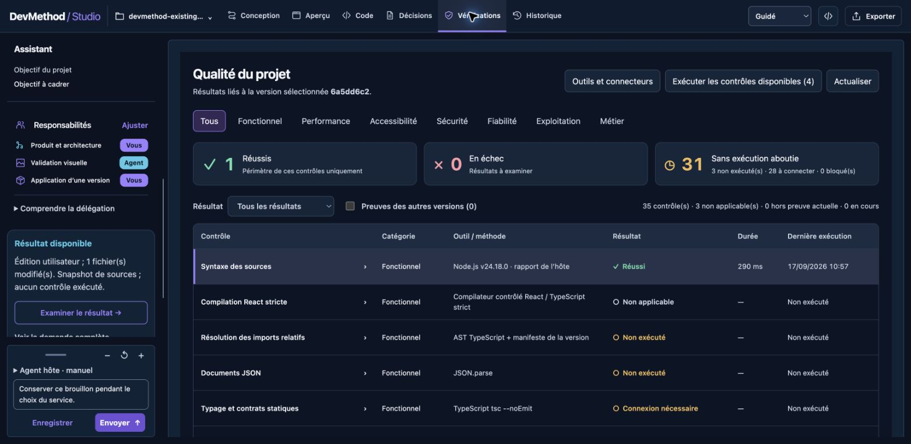

# Reprise de projets et connecteurs — 17 septembre 2026

## Ce qui est livré

- Deux entrées : création et reprise d’un dépôt existant. L’import local copie les sources dans un workspace distinct, conserve leur manifeste et construit un contexte avec provenance, exclusions et inconnues. Il ne lance ni installation ni script du projet. Les sources Next avec groupes et paramètres de route restent lisibles.
- Une référence importée reste identifiée comme telle. Les projets sans runtime compatible peuvent être parcourus, édités, versionnés et exportés comme sources ; ils ne reçoivent ni aperçu fictif ni compilation réputée réussie.
- Catalogue de 54 options : 44 services applicatifs, 10 outils de diagnostic, 20 capacités. Choix de bases/backend/authentification, mails, paiements, commerce, stockage, IA, Git, CMS, messagerie, documents, analyse d’usage, recherche et hébergement ; options API et MCP génériques.
- Fenêtre native unique : recherche, catégories et compteurs, Tous/Configurés, fiche puis configuration. Le retour conserve le filtre et le focus. Les catégories deviennent un sélecteur sur mobile. 38 SVG locaux couvrent 39 options ; les 15 autres utilisent des initiales. [Provenance et licences](../../../../CONNECTOR-ICONS.md).
- Pont hôte pour déclarer une disponibilité observée et importer un résultat borné, lié à un ticket, une configuration, un outil/version et une empreinte des sources. Les contrôles métier gardent les critères exacts ; leur modification invalide tickets et preuves concernés.
- Les règles réutilisables du kit explicitent la reprise de l’existant, le choix des services, la provenance et la boucle correction/recontrôle. [Guide de reprise](../../../../ADOPT-EXISTING-PROJECT.md).

## Essais observés

Copie fictive locale `devmethod-import-connectors-qa`, cinq sources, référence `6a5dd6c2-89eb-4100-a4fc-498f1399a000`. Le fichier `.env` est exclu. Une déclaration de dépendance ou de test ne vaut pas exécution.

1. Contexte importé, sources et inconnues consultés dans le navigateur ; référence correctement nommée et absence d’aperçu de cette stack affichée.
2. Mailpit configuré par référence de profil, état « à vérifier ». Préparer l’intégration ferme la fenêtre et ajoute la demande au brouillon existant ; aucun envoi, compte ni job de génération créé par cette préparation.
3. Contrôle réel `node --check` sur le seul `server/mail.js`, Node v24.18.0, sortie 0, 290 ms. Probe et résultat transmis par CLI authentifié ; ticket créé par l’API locale. La table affiche l’outil réel, la source hôte, la version et les limites. Sources et état principal inchangés durant cet essai. [Preuve bornée](host-check.json).
4. README modifié dans la copie Studio, snapshot conservé puis candidat `d3c72c01-6c1c-4227-ae40-bc16d22b3b68` créé sans adoption, car le cadrage n’était pas approuvé. Une nouvelle vérification après correction confirme aussi l’absence du faux avertissement de fichier binaire pendant la transition. Référence active et README original inchangés ; métadonnées du candidat : « Snapshot de sources ; aucun contrôle exécuté ». [Constat](source-edit.json).
5. Catalogue final : recherche Stripe, fiche et retour avec recherche/focus conservés ; filtre Configurés limité à Mailpit ; fiche Brevo ; Échap ferme et rend le focus au déclencheur. Un seul dialogue ouvert et aucune icône visible en erreur. À 390 × 700 CSS px, ni page ni fenêtre ne débordent horizontalement. Essai à faible hauteur : défilement du travail sans déplacement de la zone de saisie.

## Validation

La première passe globale après extension a réussi 802 tests sur 803. Le seul échec provenait du délai de démarrage de 1 s d’une fixture de processus sous charge ; ce test vérifie la priorité d’un événement d’échec, pas la vitesse. Délai porté à 5 s, assertions et test séparé de timeout conservés ; 11 tests ciblés réussis. La revue a également corrigé la liaison des contrôles métier aux critères exacts (trois régressions rouges puis vertes).

Dernière passe globale : **807/807 tests réussis**, build TypeScript/Vite inclus ; lint, formatage et liens documentaires réussis. Après le dernier ajustement de libellé du panneau Aperçu, **38/38 tests ciblés** shell/version et lint/format ciblés réussis. `npm pack --dry-run` réussi, bundle des connecteurs et guides présents ; aucune publication. La disponibilité de chaque fournisseur n’a pas été testée.

## Limites conservées

Le catalogue est configurable et prépare le travail de l’agent hôte. Il ne constitue pas 54 clients natifs vérifiés : aucun client OAuth universel, installation automatique de serveur MCP, provisionnement ni exécution arbitraire des API n’est ajouté. Un état configuré ne prouve pas la connexion ; une disponibilité attestée par l’hôte ne prouve pas l’intégration applicative. Aucun fournisseur externe n’a été appelé pour ces essais, aucun email envoyé et aucun secret saisi.

Le contrôle Node ne vérifie ni TypeScript, ni parcours métier, ni livraison des mails. Le contexte d’import est borné et ne peut retrouver des décisions absentes des sources. L’import refuse les dépassements et chemins dangereux ; il n’effectue pas une copie partielle silencieuse. Les preuves de connecteurs, tickets et paramètres d’accès restent hors export applicatif. Les limites de runtime, de confiance et d’export sont décrites dans [Import](../../../../STUDIO-IMPORT.md) et [Connecteurs](../../../../STUDIO-CONNECTORS.md).
