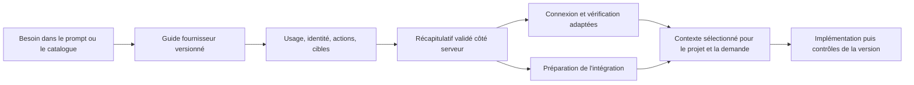

# Connecteurs Lovable — scénarios observés et cadre DevMethod

**17 septembre 2026 — navigation réelle dans Chrome, puis cadre d’intégration.** Cette tranche répond à la demande de tester plusieurs scénarios Lovable avant de structurer leur intégration dans DevMethod. Elle livre des observations, des contrats proposés et une recette ; elle ne livre pas de nouveau connecteur produit.

## Résultat utile pour DevMethod

Le parcours à reprendre est : **besoin → usage et identité → configuration adaptée au fournisseur → autorisation → vérification → contexte sélectionné dans le prompt → implémentation et preuve applicative**. Toutes les étapes ne nécessitent pas une question : quand le besoin est précis, le guide peut préremplir un récapitulatif révisable.

Trois dimensions restent indépendantes :

| Dimension                      | Exemples                                                | Conséquence                                                                                     |
| ------------------------------ | ------------------------------------------------------- | ----------------------------------------------------------------------------------------------- |
| Qui utilise le service ?       | Assistant, application, les deux                        | Un MCP sélectionné pour l’assistant ne connecte pas automatiquement l’application publiée       |
| Au nom de qui ?                | Compte partagé, bot, compte de chaque utilisateur final | App user exige une autorisation par utilisateur ; le client OAuth seul ne suffit pas            |
| Où l’accès est-il disponible ? | Espace, projet, demande courante                        | Une connexion réutilisable reste distincte de son activation dans un projet et dans une demande |

L’interface de connexion dépend aussi du fournisseur : Slack propose identité et permissions ; Brevo demande une clé ; Firecrawl propose ici un service géré ; une API personnalisée a une définition, un test de credentials et des connaissances pour l’agent. Un même formulaire générique ne couvre pas ces besoins.

## Méthode et portée

Les scénarios S1–S6 ont été parcourus depuis le [dashboard Lovable](https://lovable.dev/dashboard), dans un onglet d’audit dédié. Un projet de test intitulé [Slack Connector Explorer](https://lovable.dev/projects/cea379e2-eb23-4529-b38d-ab732464d26d) a ensuite été créé par un prompt en **mode Plan** pour S7–S8. Le projet Slack utilisateur préexistant a seulement été consulté ; son plan n’a pas été approuvé.

Les formulaires, transitions et sorties IA sont observés dans l’UI. Aucun code interne Lovable ni requête interne n’a été inspecté. Un plan généré est une proposition de l’agent, pas une preuve de son exécution. Les faits d’API doivent être recoupés avec les sources officielles du [contrat guidé](GUIDED-CONTRACT.md).

Aucune clé, aucun client secret ni identifiant de connexion n’a été saisi. Aucun consentement fournisseur n’a été accordé, aucun message Slack envoyé, aucune page Notion privée lue, aucun plan de construction approuvé. Le seul effet persistant intentionnel est le projet de test et ses échanges de planification. Coût/crédits Lovable non mesurés.

## Matrice des essais réellement effectués

| ID  | Scénario et actions                                                                                                                     | Résultat observé                                                                                                                                                                                                                                          | Limite de preuve                                                                                                   |
| --- | --------------------------------------------------------------------------------------------------------------------------------------- | --------------------------------------------------------------------------------------------------------------------------------------------------------------------------------------------------------------------------------------------------------- | ------------------------------------------------------------------------------------------------------------------ |
| S1  | Slack → App + chat ; ouvrir configuration et partage ; passer du compte personnel au bot ; cliquer Connect ; fermer la fenêtre de login | Trois blocs Details / Configure connection / Sharing. Radios personnel/bot, scopes avec descriptions, recherche et droits obligatoires. Partage privé. La fenêtre officielle Slack demande l’espace de travail. Après fermeture, Slack reste non connecté | Départ OAuth et interruption vérifiés ; aucun login, consentement, retour OAuth réussi ni appel API                |
| S2  | Slack → App user ; examiner les champs ; changer compte personnel vers installation du bot par chaque utilisateur                       | Création d’un **client**, guide OAuth en trois étapes, callback spécifique, Client ID et Client Secret. Deux types d’accès individuel proposés                                                                                                            | Aucun client créé ; isolation, renouvellement et usage par deux utilisateurs non testés                            |
| S3  | Brevo → App + chat ; soumettre une clé vide                                                                                             | Champ secret propre à Brevo, lien vers les clés du fournisseur, erreur de champ obligatoire et focus dans ce champ ; Connect désactivé après l’erreur                                                                                                     | Validation vide seulement ; ni bonne clé, ni mauvaise clé, ni appel Brevo                                          |
| S4  | Firecrawl → App + chat ; examiner la nouvelle connexion                                                                                 | Configuration gérée par Lovable, partage à tous les membres du workspace, conditions du fournisseur avant Connect                                                                                                                                         | Aucun provisionnement ni acceptation des conditions ; aucun droit à transposer ce service géré dans DevMethod      |
| S5  | Ajouter un MCP ; basculer OAuth, Bearer/API key, sans auth ; saisir un nom et une URL manifestement non valide puis annuler             | OAuth affiche Add & authorize ; Bearer ajoute un champ secret ; sans auth supprime ce champ. Bouton désactivé quand les champs sont vides. Avec nom + texte non vide à la place de l’URL, Add server devient actif                                        | URL non soumise : ni succès ni défaut de validation serveur démontré ; aucun serveur créé                          |
| S6  | Ajouter une API personnalisée ; ouvrir les trois blocs ; parcourir les six méthodes d’authentification                                  | Présentation du service ; Bearer, header, query, Basic, Advanced, OAuth ; URL de base, requête de test ; fichiers de connaissance pour l’agent. La définition ne reçoit pas de credentials                                                                | Aucun connecteur créé ni requête de test exécutée ; seules les variantes du formulaire sont vérifiées              |
| S7  | Nouveau prompt Slack vague en Plan ; répondre aux trois questions ; retour arrière ; soumettre ; lire le plan                           | Question de type de connexion, fonctionnalités à choix multiples, identité ; conservation du choix après retour ; résumé structuré dans le chat puis plan avec Review / Skip / Approve                                                                    | Plan non approuvé ; carte de connexion promise pour la suite, pas exercée dans ce scénario                         |
| S8  | Suivi Plan : Notion pour le contexte de l’assistant entre projets, sans usage dans l’application                                        | L’agent ajoute un scénario MCP/Chat au plan, distingue App et App user, décrit connexion/vérification/déconnexion sans nouveau questionnaire                                                                                                              | Plan non approuvé. Aucun accès Notion testé ; les garanties de lecture seule écrites par l’IA ne sont pas établies |

La couverture est représentative de familles de parcours ; elle n’équivaut pas à une validation des 115 entrées affichées dans le catalogue. Les paramètres observés peuvent dépendre du workspace et de son offre.

## S1–S2 : identité, droits et connexion Slack

Dans S1, `channels:history` et `channels:read` apparaissent obligatoires et non modifiables. Plusieurs autres scopes sont déjà sélectionnés dans cette session ; cela ne permet pas de généraliser leur valeur par défaut à tous les comptes. Le passage au bot fait notamment apparaître une permission de personnalisation des messages sélectionnée. Le partage privé indique que les personnes auxquelles on partage pourront utiliser la connexion dans leurs projets ; aucun partage n’a été effectué.

La fenêtre officielle Slack affiche une demande de workspace avant l’authentification. Les paramètres visibles distinguent scopes bot et utilisateur et utilisent PKCE S256. L’URL complète de session, son état et son challenge ne sont pas conservés dans les preuves. Fermer cette fenêtre ne produit pas un succès de connexion.

Dans S2, le constructeur configure un client OAuth ; l’utilisateur final effectuera ensuite sa propre autorisation. Callback affiché : `https://connector-gateway.lovable.dev/api/v1/app-users/oauth2/callback`. Cette URL appartient à Lovable : elle ne doit jamais être copiée comme callback DevMethod. [Capture App user](guided-scenarios/slack-app-user.png).

**Transposition :** le guide DevMethod doit demander identité et actions séparément, expliquer les droits utiles, montrer les prérequis et garder le besoin lors d’une annulation. Les capacités MCP existantes ne suffisent pas à fournir Slack OAuth bot ou un runtime App user. Les contraintes officielles Slack sont détaillées dans [GUIDED-CONTRACT.md](GUIDED-CONTRACT.md#prérequis-mcp-slack-qui-changent-réellement-le-parcours).

## S3–S6 : formulaires adaptés et contrat de service

Brevo illustre une validation contextualisée : champ secret, aide pour obtenir la clé, erreur à proximité, aucun succès fictif. [Capture de la validation vide](guided-scenarios/brevo-required-key.png). Firecrawl montre une autre famille : service géré et conditions associées. Le nom d’un fournisseur ne permet pas de déduire son mécanisme de connexion.

Le MCP personnalisé demande un endpoint et son mode d’accès. L’API personnalisée demande une définition réutilisable avant les credentials de chaque connexion. Ses variantes observées :

| Méthode API         | Configuration affichée                                                                                                             |
| ------------------- | ---------------------------------------------------------------------------------------------------------------------------------- |
| Bearer              | Libellé du credential et exemple d’en-tête Authorization                                                                           |
| Header personnalisé | Nom d’en-tête, préfixe facultatif, exemple de requête                                                                              |
| Paramètre de query  | Nom du paramètre et exemple de requête                                                                                             |
| Basic               | Explication username/password et exemple Basic                                                                                     |
| Advanced            | Clé interne, label, emplacement d’envoi, caractère secret de chaque champ ; ajout/retrait de champs                                |
| OAuth 2.0           | Endpoints authorization/token, scopes, séparateur, PKCE, callback affiché ; client ID/secret fournis ultérieurement à la connexion |

Tous présentent la base API et une requête de contrôle des credentials, avec méthode et chemin. Le texte conseille un endpoint authentifié retournant le compte. Les fichiers de connaissance ont nom, description d’usage et contenu ; ils doivent documenter endpoints et exemples sans credentials. Le passage Basic → Advanced conserve les champs username/password dans la session observée.

**Transposition :** séparer `ProviderDefinition`, `Connection`, `ProjectBinding` et `RequestSelection`. Le test des credentials appartient à la connexion, la découverte d’outils au MCP, les instructions d’intégration à la définition. La définition ne devient jamais une preuve d’accès.

## S7 : du besoin au récapitulatif conversationnel

Prompt exécuté :

> Projet de test UX : Audit connecteurs DevMethod. Je souhaite intégrer Slack à une application de suivi de projets. Guide-moi pour choisir le bon type de connexion et les fonctionnalités utiles. Reste en mode Plan : ne génère pas de code, ne crée aucune connexion et n’envoie aucun message Slack.

Séquence observée :

1. App Connector / App User Connector / indécis / réponse libre. App Connector présélectionné ; choix conservé.
2. Notifications, lecture/recherche, envoi manuel, événements entrants, réponse libre. Notifications décochées, **envoi manuel au clic** coché.
3. Bot / compte personnel / canal unique / à définir. Bot conservé. Retour à l’étape 2 : envoi manuel toujours coché et notifications toujours décochées. Retour à l’étape 3 puis Submit.
4. Carte récapitulative avec type, fonctionnalité et identité. Plan détaillé dans un panneau de lecture et commandes de revue. Aucun bouton Approve utilisé.

[Question dans le chat](guided-scenarios/slack-ai-question.png), [récapitulatif et plan](guided-scenarios/slack-ai-review.png).

Le plan propose une connexion bot, une fonction serveur d’envoi, une sélection de canal, un aperçu du message et des tests ultérieurs. Il ne démontre aucun de ces éléments. Son affirmation sur l’accès aux canaux publics est spécifique à sa description du connecteur Lovable et n’est pas validée par cet essai. Elle ne remplace pas les règles Slack `chat:write`, `chat:write.public` et d’appartenance aux canaux.

La troisième question mélange identité (bot/personne) et cible (canal). **DevMethod doit séparer ces axes.** L’IA peut expliquer et proposer les choix ; une définition versionnée et des validateurs fournisseur doivent contrôler leur cohérence. Une liste de réponses générée librement ne constitue pas un contrat d’autorisation.

## S8 : Notion comme contexte de l’assistant

Le second message précise un besoin de consultation de documentation entre projets et exclut l’usage Notion par l’application publiée. Lovable ajoute un deuxième scénario au plan Slack existant, sans poser d’autre question. Il choisit MCP/Chat et écarte App Connector et App user pour ce besoin. Le plan décrit des états non connecté, autorisation, connecté, vérification, déconnexion. Aucun de ces changements d’accès n’est exécuté pendant l’essai.

Une faiblesse de contenu apparaît : le plan promet que les écritures et pages privées resteraient hors de portée après connexion et décrit un partage explicite de pages. Cela n’est pas une garantie démontrée du MCP hébergé. La [documentation officielle Notion](https://developers.notion.com/guides/mcp/get-started-with-mcp), consultée le même jour, décrit l’accès en lecture et modification au contenu accessible au compte dans l’espace choisi. La simple demande de consultation ne réduit donc pas le grant OAuth.

**Conséquence DevMethod :** conserver trois faits séparés : intention de lecture, accès effectivement accordé par le fournisseur, outils/opérations autorisés pour la demande. Si une restriction est appliquée par DevMethod, la nommer comme telle et l’imposer dans le courtier d’outils ; ne pas annoncer un droit fournisseur réduit sans preuve. Une lecture de page publique, proposée dans le plan, ne suffit pas à prouver l’accès au corpus privé visé. Le contrôle devra porter sur une ressource de test explicitement désignée et autorisée.

## Cadre d’intégration et ordre de réalisation

Les noms d’objets ci-dessous sont des concepts proposés, pas des endpoints déjà livrés. Le détail de sauvegarde/version/validation se trouve dans [GUIDED-CONTRACT.md](GUIDED-CONTRACT.md), et les composants réutilisables dans [GUIDED-UI-AUDIT.md](GUIDED-UI-AUDIT.md).

La préparation peut avancer avec un accès encore manquant. L’état doit rester explicite : préparation prête, accès non connecté, fonctionnalité à implémenter.

| Lot                         | Livrable borné                                                                                                                   | Critère d’acceptation observable                                                                                                                                                                                                   |
| --------------------------- | -------------------------------------------------------------------------------------------------------------------------------- | ---------------------------------------------------------------------------------------------------------------------------------------------------------------------------------------------------------------------------------- |
| G1 — Guide typé             | Définitions Slack API bot/utilisateur et Notion/Linear MCP, réponses validées, permissions expliquées, prérequis et support réel | Besoin « partager un résumé » produit un plan cohérent ; une combinaison inconnue est rejetée ; aucun jeton ou faux statut connecté                                                                                                |
| G2 — UI commune             | Même guide depuis catalogue, chip du prompt et fiche projet ; questions progressives, résumé éditable, conservation du brouillon | Aller-retour, fermeture/réouverture et sauvegarde lente ne perdent ni brief ni réponses ; clavier et mobile vérifiés                                                                                                               |
| G3 — Raccord agent          | Contexte structuré et versionné dans Home, projet existant et snapshot de demande ; état des connexions visible                  | Le besoin exact arrive à l’agent, le texte saisi reste intact ; changement de configuration détecté ; aucune exécution déclenchée par une sélection seule                                                                          |
| G4 — Connexions fournisseur | MCP existant réutilisé ; adaptateur OAuth préenregistré ou API natif ajouté fournisseur par fournisseur                          | Succès uniquement après preuve réelle ; refus/fermeture/expiration/scopes manquants vérifiés ; coût et limites du fournisseur exposés si pertinents                                                                                |
| G5 — App user et API custom | Runtime d’identités individuelles, contrats API réutilisables et gestion des grants                                              | Deux utilisateurs isolés, révocation et refresh testés ; test de credential protégé ; saisie secrète temporaire distincte du guide, aucune persistance navigateur, inclusion dans le prompt, journalisation ou réexposition de clé |

G1–G3 constituent la première tranche proposée. G4 nécessite des essais authentifiés ciblés avec les comptes et clients réels adéquats. G5 élargit l’architecture au runtime applicatif et aux identités individuelles ; un écran seul ne suffit pas. Les connexions API projet restent distinctes des MCP réutilisables de l’espace conformément au besoin exprimé.

## Recette à exécuter dans DevMethod après implémentation

| Cas                                     | Attendu                                                                                                            | Niveau de test                                      |
| --------------------------------------- | ------------------------------------------------------------------------------------------------------------------ | --------------------------------------------------- |
| Slack API bot + partage manuel          | Identité bot, cible séparée, permissions justifiées, fonction serveur à préparer                                   | Règles de domaine + UI + contexte de demande        |
| Passer bot → utilisateur                | Réponses incompatibles retirées explicitement, réponses communes conservées                                        | Règles + UI                                         |
| Notion pour l’assistant                 | Connexion MCP réutilisable, sélection visible dans le prompt, aucune dépendance Notion ajoutée au runtime de l’app | Contrat lancement/job + UI                          |
| API projet avec accès absent            | Action de préparation disponible, accès signalé manquant ; pas de badge connecté                                   | Contrat + UI                                        |
| Fermer/refuser OAuth                    | Besoin conservé, connexion non sélectionnable comme connectée                                                      | Adaptateur OAuth avec fixture puis fournisseur réel |
| Mauvaise clé / compte reconnu           | Échec explicite / identité observée ; aucune fonctionnalité déclarée implémentée par ce seul contrôle              | Fixture isolée puis fournisseur réel                |
| Permissions manquantes                  | Fonction concernée indisponible et droits précis à compléter                                                       | Adaptateur + erreur UI                              |
| Version modifiée pendant sauvegarde/job | Conflit visible, brouillon conservé, preuves non réattribuées                                                      | Backend CAS + réponse différée UI                   |
| App user A puis B                       | Aucune donnée/grant de A dans la session B ; révocation limitée au compte visé                                     | Intégration multi-identités, tranche G5             |
| Service personnalisé mal configuré      | URL/auth/test validés, destinations réseau contrôlées, aucune fuite de credential                                  | Contrat + adaptateur réseau, tranche G5             |

Ces cas sont **à exécuter**, pas des tests déjà réussis. Les deux défauts de conservation de brouillon identifiés par lecture du code sont détaillés dans l’audit UI et doivent recevoir des tests de régression.

## Preuves et reprise

- [Observations DOM/texte](guided-scenarios/observations.json) : captures de texte des formulaires et réponses IA, sans URL OAuth de session ; les clés de l’objet correspondent aux étapes.
- Les quatre captures PNG liées ci-dessus ont été relues visuellement. Elles attestent le rendu desktop observé, pas l’accessibilité complète ni le mobile.
- [Contrat backend proposé](GUIDED-CONTRACT.md), [audit UI et critères](GUIDED-UI-AUDIT.md), [recherche officielle précédente](RESEARCH.md).
- Code DevMethod inspecté : `28418f05a3399531779d9a4c5be922011cac96ac`. Aucun changement de runtime dans cette tranche. Les validations produit précédentes ne sont pas réattribuées à une fonctionnalité guidée encore à réaliser.

Vérifications documentaires : liens locaux contrôlés par `npm run check:docs`, format Markdown/JSON vérifié explicitement, JSON relu (23 observations non vides), absence d’URL OAuth temporaire dans ce JSON. Revue indépendante des trois documents : 31 liens/ancres contrôlés ; deux ambiguïtés corrigées (authentification MCP seulement si requise ; saisie secrète temporaire distincte d’une persistance navigateur). Les suites produit n’ont pas été relancées pour ces seuls documents.
