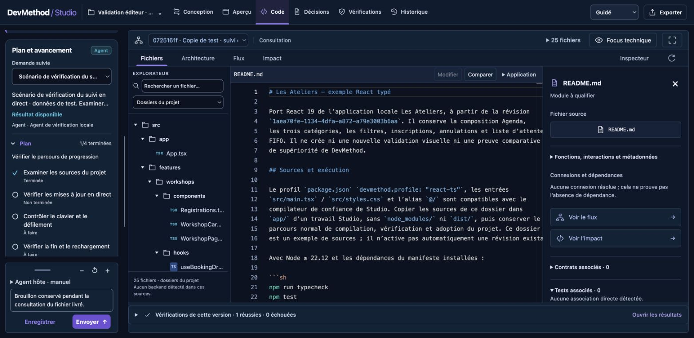

# Suivi du plan et des actions — 17 septembre 2026

Implémentation locale après `b8724c1`, sans appel fournisseur. [Contrat](../../../../STUDIO-PROGRESS.md) et [décision](../../../../ADR-020-live-job-progress.md). Le journal durable par demande alimente le plan, les étapes et les actions dans le fil ; actualisation toutes les deux secondes, pause de l’onglet masqué, reprise et erreur réseau explicites. Le journal ne crée aucune preuve qualité ni validation humaine.

## Vérifications exécutées

- `npm test` : **746 tests, 746 réussis**, aucun ignoré. Inclut contrats, CLI, HTTP local authentifié, idempotence persistante, collision, bornes, publications tardives, compilation réelle, décodage du runner et interactions React. `npm run lint`, `npm run format:check`, `npm run check:docs` réussis. Paquet inspecté avec `npm pack --dry-run`.
- Trois régressions observées avant correction : collision d’identifiants d’actions, ouverture du fichier masquée par Architecture/Flux/Impact, erreur globale conservée après reconnexion. Les contrôles correspondants passent après correction.
- Navigateur Chrome, copie isolée explicitement marquée de démonstration : publication d’une étape via le bridge CLI, passage de 1/4 à 2/4 sans rechargement ; focus, brouillon, journal déplié et position de défilement conservés.
- Vraie molette au-dessus du journal court : la colonne défile sans sélectionner de texte. Entrée replie/déplie le plan, focus visible. À 1280 × 500, saisie toujours accessible ; à 390 × 700, lien vers la discussion et saisie accessible, aucun débordement horizontal observé.
- Arrêt du serveur : erreur d’actualisation visible et dernier plan conservé. Redémarrage : demande interrompue, étapes inachevées conservées. Aucune réussite inventée.
- Livraison locale réellement compilée avec modification du README dans le staging de test. Révision `0725161f-1798-4bfe-aeb4-c5c514019a47`, version active inchangée. Depuis Architecture, « Ouvrir le fichier » ouvre README dans Fichiers sur cette livraison ; brouillon conservé. Le plan intentionnellement incomplet reste 1/4 malgré la disponibilité du résultat.

La revue React porte sur une souscription nettoyée/annulée, l’absence de réponses obsolètes et la navigation contrôlée sans remontage de l’éditeur. Les références Vercel épinglées restent intactes ; aucune conformité globale n’est déduite de cette revue.

## Limites

Les événements navigateur ont été publiés par un scénario local identifié ; ils ne constituent pas un essai fournisseur natif. Le décodage du runner est vérifié avec des fixtures. Un agent hôte externe doit publier explicitement via le bridge ; Studio n’intercepte pas ses outils. Les anciens travaux n’ont pas de plan reconstitué. Les journaux de progression ne sont pas encore inclus dans l’export Studio. Contrôle agent, sans validation humaine ni audit d’assistance technique spécialisée.
