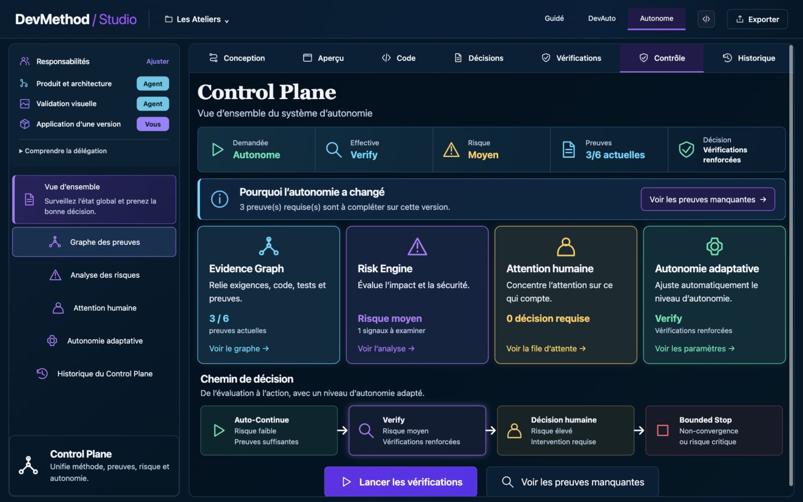
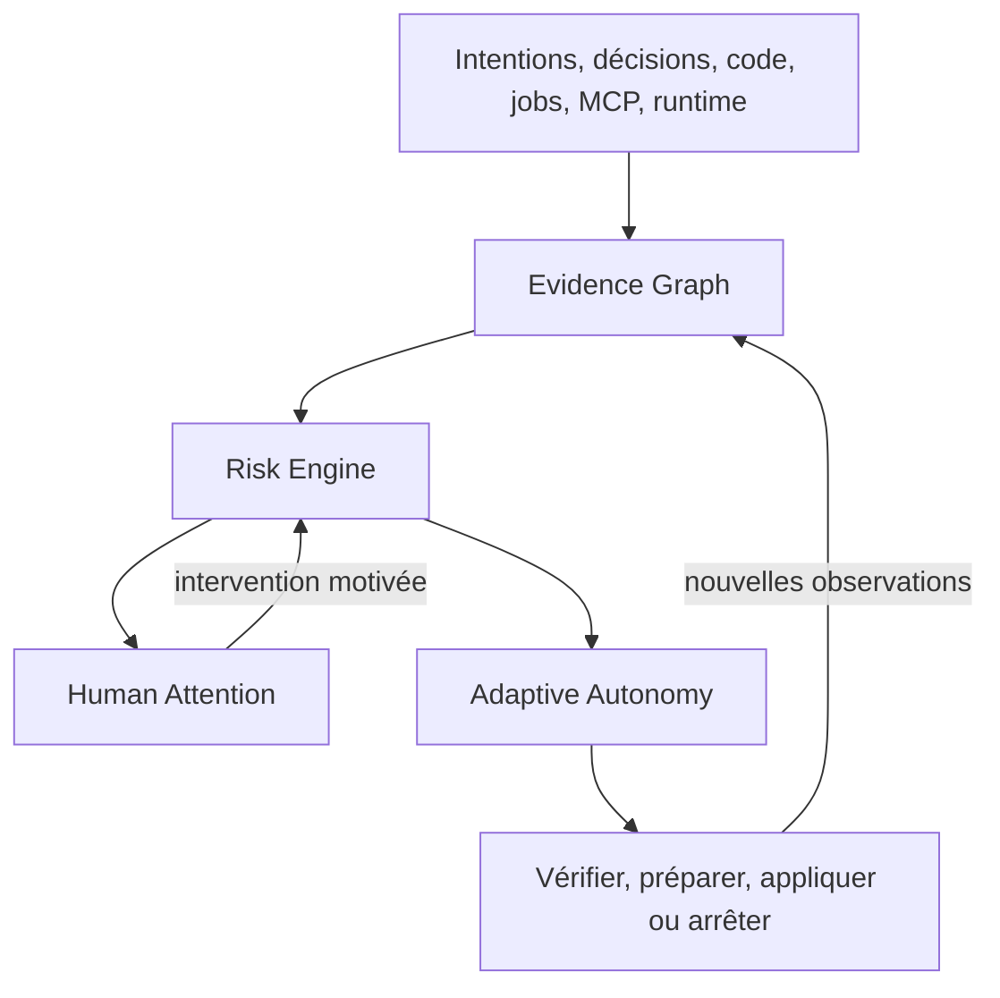
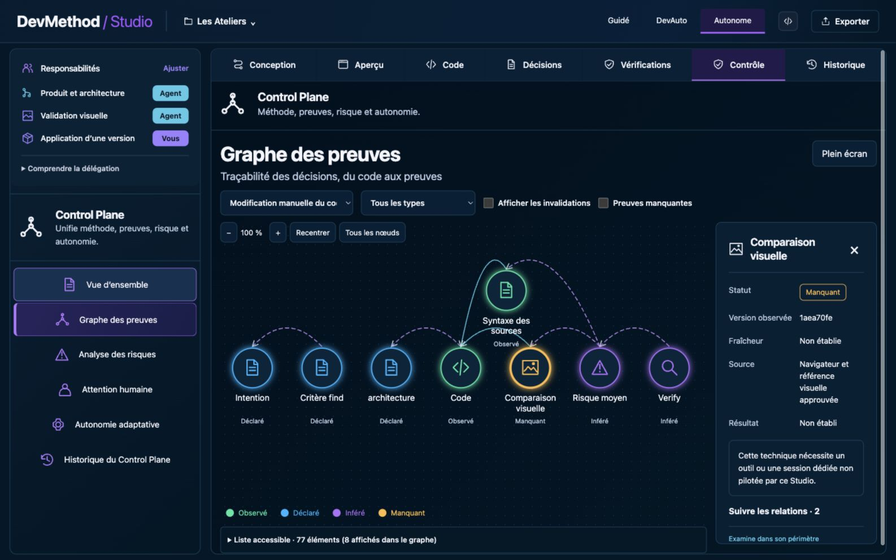
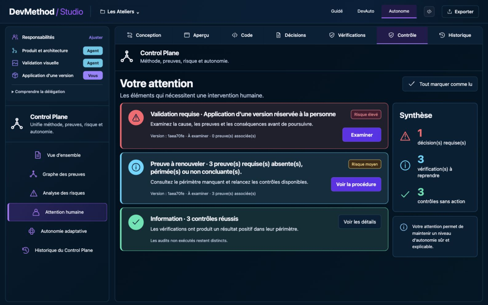

# Comprendre le Control Plane

Le Control Plane relie les sources déjà présentes dans le Studio pour produire une décision
explicable. Sa politique actuelle est `control-plane-v1`, déterministe et sans calibration apprise.

## Boucle fonctionnelle

## Evidence Graph

Chaque nœud possède nature, fraîcheur, résultat, provenance, version, dépendances et limites. Une
preuve favorable doit être **observée**, **actuelle** et **réussie**. Le compteur `3/6` signifie que
trois des six preuves requises remplissent ces conditions.

Une nouvelle révision périme les preuves dont les fichiers, le périmètre, la dépendance amont ou
l'expiration ont changé. Une preuve sans périmètre complet reste attachée à sa révision.

## Risk Engine

Le moteur agrège des signaux explicables et retient le plus grave actif. La politique considère
notamment preuves insuffisantes, sources indisponibles, étendue du changement, zones sensibles,
permissions MCP, marqueurs de secrets, réversibilité et convergence. Il ne calcule ni moyenne ni
probabilité de confiance.

## Human Attention

Une entrée indique cause, gravité, version, action, preuves liées et intervention attendue. Marquer
comme lu ne résout rien. Accepter ou refuser exige une justification et ne vaut que pour le contexte
exact. Un accord ne fabrique pas de preuve et ne remplace pas une permission MCP.

## Adaptive Autonomy

Ordre de priorité :

1. arrêt persistant, refus applicable ou critique → `Bounded Stop` ;
2. risque élevé ou responsabilité réservée → `Human Decision` ;
3. risque moyen ou preuve insuffisante → `Verify` ;
4. faible risque, preuves suffisantes et délégation valide → `Auto-Continue`.

Les modes Guidé, DevAuto et Autonome restent des demandes. Même `Auto-Continue` ne contourne pas
la délégation d'application, la base de livraison, le cadrage ou la concurrence de jobs.

## Code propriétaire

| Responsabilité | Fichier |
| --- | --- |
| Contrats | `src/control-plane/contracts.ts` |
| Politique de risque/autonomie | `src/control-plane/policy.ts` |
| Évaluation, attention et interventions | `src/control-plane/engine.ts` |
| Invalidation | `src/control-plane/graph.ts` |
| Collecte des sources Studio | `scripts/studio/control-sources.mjs` |
| Coordination et persistance | `scripts/studio/control-plane.mjs` |
| API | `scripts/studio/control-routes.mjs` |
| UI | `studio-ui/src/features/control/` |

Lire ensuite l'[ADR 027](../ADR-027-control-plane.md) et les
[résultats de vérification](../missions/control-plane/RESULTS.md).
