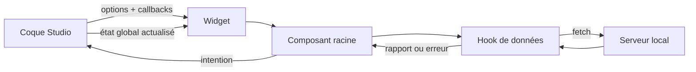

# Interface Studio : coque, îlots React et état

## Deux générations qui coexistent

Le Studio n'est pas une application React monolithique. La coque et certaines vues historiques se
trouvent dans [`scripts/studio/public/`](../../scripts/studio/public/). Les espaces complexes sont
des îlots React compilés depuis [`studio-ui/src/`](../../studio-ui/src/), puis montés par un fichier
`*-widget.tsx`.

Cette architecture permet une migration progressive, mais impose une règle : le contrat de montage
est une frontière publique locale. Une vue React ne doit pas supposer qu'elle possède tout le DOM.

## Anatomie d'un îlot

Le Control Plane illustre la séparation recommandée :

| Couche | Exemple | Responsabilité |
| --- | --- | --- |
| montage | `control-widget.tsx` | créer/détruire la racine React |
| composition | `ControlPlane.tsx` | sélectionner les vues et les portails |
| état serveur | `useControl.ts` | requêtes, polling, mutations, annulation |
| modèle de vue | `model.ts` | labels, types et sélections pures |
| vues | `Overview`, `EvidenceGraph`, `Attention` | présentation et intentions utilisateur |
| géométrie pure | `graph-layout.ts` | boîtes, lignes et libellés du graphe |

Pour le projet, `project-widget.tsx` monte `ProjectWorkbench`, dont les contrats vivent dans
`features/project/model/contracts.ts` et les vues dans `features/project/components/`.

## Flux d'état

Le serveur reste propriétaire des règles et de l'état durable. Le composant conserve seulement
l'état de navigation, de sélection, de chargement et de saisie nécessaire à son expérience.

## États que toute vue asynchrone doit traiter

1. **initial** : aucune réponse reçue ;
2. **loading** : requête en cours sans bloquer la navigation globale ;
3. **success** : données validées pour la génération actuelle ;
4. **empty** : réponse valide mais aucune entité à montrer ;
5. **error sans données** : action de reprise claire ;
6. **error avec données précédentes** : contenu visible mais explicitement obsolète ;
7. **busy mutation** : double soumission empêchée ;
8. **superseded** : réponse tardive ignorée après changement de révision ou démontage.

## Navigation et URL

Les sous-vues du Control Plane sont reflétées dans `?control=...#control`. `popstate` restaure la
vue, ce qui rend historique et liens profonds utiles. Sur petit écran, la navigation change de
forme mais conserve les mêmes labels et le même état.

Une nouvelle vue doit donc vérifier : URL directe, retour navigateur, petit écran, scroll de
l'espace de travail et focus après action.

## Accessibilité opérationnelle

- erreurs : `role="alert"` ;
- progression : `role="status"` ;
- vue active : `aria-current="page"` ;
- mode choisi : `aria-pressed` ;
- activité du rapport : `aria-busy` ;
- boutons désactivés pendant une mutation ;
- information critique exprimée par texte, pas uniquement par couleur.

Une capture ne vérifie pas ces propriétés. Utilisez l'arbre d'accessibilité et les interactions
clavier dans un navigateur réel.

## Ajouter un îlot ou une fonctionnalité

1. réutiliser un widget existant si le domaine est le même ;
2. définir des options étroites et des callbacks d'intention ;
3. placer les types métier partagés dans le modèle du feature ;
4. isoler calculs purs et géométrie de la vue ;
5. gérer les huit états asynchrones applicables ;
6. ajouter un test du modèle, un test du widget et un parcours navigateur proportionné ;
7. vérifier montage, mise à jour et `dispose` ;
8. documenter le flux serveur correspondant.
