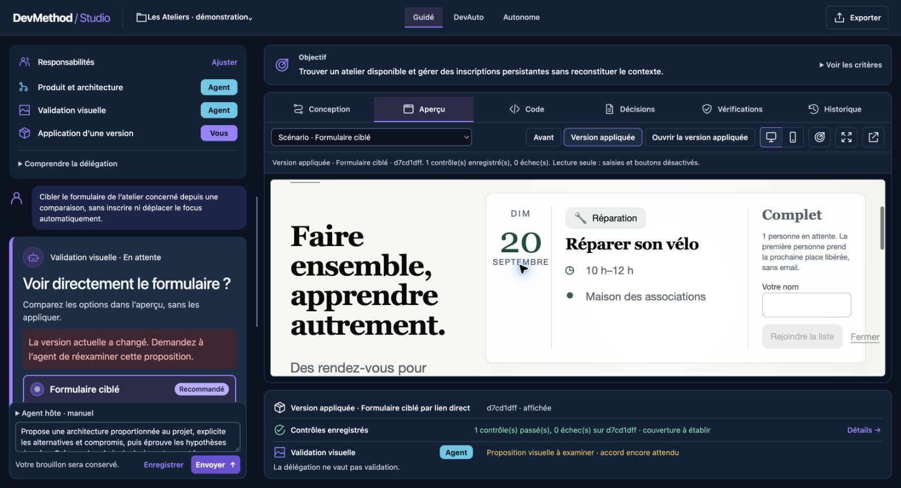

# Guide utilisateur du Studio

## Démarrer

Depuis un checkout ou une installation compatible avec Node.js 22+ :

```sh
devmethod studio
```

L'accueil local permet de créer, importer ou reprendre un projet. Un lancement direct d'un
workspace connu utilise `devmethod studio serve --workspace /chemin/absolu` ; les options exactes
restent décrites dans [le guide historique](../STUDIO.md).

## Tutoriel guidé dans un workspace jetable

Ce parcours montre l'état réel du Studio sans modifier un projet personnel. Les commandes suivantes
s'exécutent depuis le checkout DevMethod. Sur macOS, utilisez le chemin réel `/private/tmp` plutôt
que son lien symbolique `/tmp`. Elles créent uniquement `/private/tmp/devmethod-learning-studio`.

### 1. Créer l'exemple

```sh
node scripts/studio.mjs example --workspace /private/tmp/devmethod-learning-studio
```

Résultat attendu : le dossier contient un projet exemple, son registre `.devmethod` et les sources
de l'application. Si le dossier existe déjà, choisissez un autre chemin au lieu d'écraser son état.

### 2. Lancer le Studio

```sh
node scripts/studio.mjs serve --workspace /private/tmp/devmethod-learning-studio --port 4380 --preview-port 4381
```

Ouvrez `http://127.0.0.1:4380`. Le terminal reste propriétaire du serveur ; `Ctrl+C` l'arrête. Si un
port est occupé, choisissez deux autres ports libres.

### 3. Identifier l'état initial

Dans l'interface, retrouvez :

- le brief et les décisions de conception ;
- la révision active et les candidates éventuelles ;
- les jobs et leur état ;
- les contrôles disponibles, exécutés ou indisponibles ;
- la décision du Control Plane et la révision qu'elle concerne.

Ouvrez ensuite `.devmethod/studio.json` en lecture seule. Reliez un identifiant visible dans
l'interface à son enregistrement. Ne modifiez pas ce fichier pendant que le Studio fonctionne.

### 4. Suivre une demande

Saisissez une évolution simple et réversible. Avant de l'envoyer, notez la révision active. Après
l'envoi, observez successivement :

1. la demande enregistrée ;
2. le job `queued`, puis `running` si un agent compatible est configuré ;
3. les événements de progression, qui restent des déclarations ;
4. la candidate créée, distincte de la révision active ;
5. les contrôles liés à cette candidate ;
6. la nouvelle décision du Control Plane.

Sans agent configuré, le job peut rester en attente. Ce résultat est valide pour l'exercice : il
montre que l'interface ne fabrique pas une exécution.

### 5. Lire une preuve correctement

Dans **Vérifications**, choisissez un contrôle et notez : identifiant, source, révision, état,
fraîcheur et limite. Dans **Contrôle**, retrouvez le nœud correspondant. Un résultat favorable doit
être observé, actuel et réussi ; `declared`, `running` ou `stale` reste insuffisant.

### 6. Comprendre une application

Une candidate n'est pas activée parce que le job est terminé. L'application revérifie version,
snapshot, délégation, plan, responsabilités réservées et absence de conflit. Si l'interface demande
une décision humaine, lisez sa cause et sa révision avant d'accepter ou refuser. Une acceptation ne
transforme jamais une preuve manquante en succès.

### 7. Vérifier la reprise

Arrêtez le serveur avec `Ctrl+C`, relancez la même commande et vérifiez que projets, révisions,
décisions et journaux sont restaurés. Un travail qui était `running` ne doit pas devenir réussi par
le simple redémarrage.

### Ce que le tutoriel démontre

| Observation | Conclusion permise | Conclusion interdite |
| --- | --- | --- |
| le Studio redémarre avec le registre | cette reprise locale a fonctionné | toute panne est récupérable |
| un contrôle passe | ce contrôle a réussi sur cette révision | le projet est globalement sûr |
| une candidate est visible | un résultat peut être inspecté | il est déjà appliqué ou publié |
| le Control Plane affiche `Auto-Continue` | une tentative est admissible dans ce contexte | toute action est autorisée |

## Lire l'interface



| Vue | Ce qu'elle montre | Limite importante |
| --- | --- | --- |
| Conception | Besoin, critères, directions et responsabilités | Une intention n'est pas sa preuve |
| Aperçu | Version active, candidate ou comparée | La comparaison ne valide pas le métier |
| Code | Fichiers, Architecture, Flux, Impact | Les graphes sont des analyses statiques partielles |
| Décisions | Choix, alternatives, raisons et sources | Déclaratif jusqu'à vérification du code |
| Vérifications | Contrôles, preuves, demandes et limites | Un audit absent reste absent |
| Contrôle | Risque, attention et autonomie effective | Ne remplace pas les permissions MCP |
| Historique | Missions, versions et événements | Une progression déclarée n'est pas un test |

## Cycle d'une évolution

1. La demande crée une mission.
2. Un agent autorisé la prend en charge.
3. Son travail produit une révision candidate immuable.
4. Les contrôles sont exécutés ou demandés pour cette révision.
5. Le Control Plane recalcule risque et autonomie.
6. L'application vérifie encore délégation, base, plan et absence de concurrence.

Pour suivre cette chaîne dans le code, utilisez les [traces de requêtes](../architecture/REQUEST-LIFECYCLE.md),
l'[atlas des moteurs](../architecture/ENGINE-ATLAS.md) et les
[dossiers de code annotés](../maintainers/CODE-DOSSIERS.md).

## Données et reprise

Chaque workspace possède son registre local et ses journaux sous `.devmethod`. Le Studio utilise
des limites explicites et des écritures atomiques. Les projets importés sont copiés ; l'original
n'est pas modifié. Aucun balayage global du disque ou déploiement cloud n'est effectué.

## Connecteurs et services

Un outil choisi dans le catalogue n'est ni installé ni connecté automatiquement. Les actions MCP
possèdent leurs permissions `deny`, `ask` ou `allow`. Les services déclarés dans
`devmethod.project.json` décrivent une topologie ; ils ne deviennent pas exécutables par cette
seule déclaration. Voir [connecteurs](../STUDIO-CONNECTORS.md) et [services](../STUDIO-SERVICES.md).
